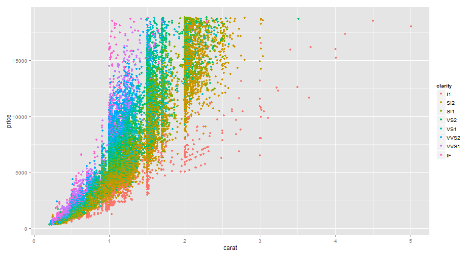

## What is this Presentation?

1. Use as second part of Peer Assessments Course Project of Developing Data Products
2. Objective is show how to simple create an reproducible presentation using Silify
3. This presentation is based on Diamonds dataset
4. Use some R code and graphic

--- .class #id 

## Dataset Presentation

**Summarize the Diamonds dataset**


```r
str(diamonds)
```

```
## 'data.frame':	53940 obs. of  10 variables:
##  $ carat  : num  0.23 0.21 0.23 0.29 0.31 0.24 0.24 0.26 0.22 0.23 ...
##  $ cut    : Ord.factor w/ 5 levels "Fair"<"Good"<..: 5 4 2 4 2 3 3 3 1 3 ...
##  $ color  : Ord.factor w/ 7 levels "D"<"E"<"F"<"G"<..: 2 2 2 6 7 7 6 5 2 5 ...
##  $ clarity: Ord.factor w/ 8 levels "I1"<"SI2"<"SI1"<..: 2 3 5 4 2 6 7 3 4 5 ...
##  $ depth  : num  61.5 59.8 56.9 62.4 63.3 62.8 62.3 61.9 65.1 59.4 ...
##  $ table  : num  55 61 65 58 58 57 57 55 61 61 ...
##  $ price  : int  326 326 327 334 335 336 336 337 337 338 ...
##  $ x      : num  3.95 3.89 4.05 4.2 4.34 3.94 3.95 4.07 3.87 4 ...
##  $ y      : num  3.98 3.84 4.07 4.23 4.35 3.96 3.98 4.11 3.78 4.05 ...
##  $ z      : num  2.43 2.31 2.31 2.63 2.75 2.48 2.47 2.53 2.49 2.39 ...
```

---
## Diamond Weight vs Cut
**Relationship between weight of the diamond and quality of the cut**


```
##      Fair      Good Very Good   Premium     Ideal 
## 1.0461366 0.8491847 0.8063814 0.8919549 0.7028370
```


<div id = 'chart1' class = 'rChart nvd3'></div>
<script type='text/javascript'>
 $(document).ready(function(){
      drawchart1()
    });
    function drawchart1(){  
      var opts = {
 "dom": "chart1",
"width":    800,
"height":    400,
"x": "color",
"y": "carat",
"group": "cut",
"type": "multiBarChart",
"id": "chart1" 
},
        data = [
 {
 "carat":           0.32,
"cut": "Premium",
"color": "E",
"clarity": "I1",
"depth":           60.9,
"table":             58,
"price": 345,
"x":           4.38,
"y":           4.42,
"z":           2.68 
},
{
 "carat":           1.17,
"cut": "Very Good",
"color": "J",
"clarity": "I1",
"depth":           60.2,
"table":             61,
"price": 2774,
"x":           6.83,
"y":            6.9,
"z":           4.13 
},
{
 "carat":           1.01,
"cut": "Premium",
"color": "F",
"clarity": "I1",
"depth":           61.8,
"table":             60,
"price": 2781,
"x":           6.39,
"y":           6.36,
"z":           3.94 
},
{
 "carat":           1.01,
"cut": "Fair",
"color": "E",
"clarity": "I1",
"depth":           64.5,
"table":             58,
"price": 2788,
"x":           6.29,
"y":           6.21,
"z":           4.03 
},
{
 "carat":           0.96,
"cut": "Ideal",
"color": "F",
"clarity": "I1",
"depth":           60.7,
"table":             55,
"price": 2801,
"x":           6.37,
"y":           6.41,
"z":           3.88 
},
{
 "carat":           1.04,
"cut": "Premium",
"color": "G",
"clarity": "I1",
"depth":           62.2,
"table":             58,
"price": 2801,
"x":           6.46,
"y":           6.41,
"z":              4 
},
{
 "carat":              1,
"cut": "Fair",
"color": "G",
"clarity": "I1",
"depth":           66.4,
"table":             59,
"price": 2808,
"x":           6.16,
"y":           6.09,
"z":           4.07 
},
{
 "carat":            1.2,
"cut": "Fair",
"color": "F",
"clarity": "I1",
"depth":           64.6,
"table":             56,
"price": 2809,
"x":           6.73,
"y":           6.66,
"z":           4.33 
},
{
 "carat":           0.43,
"cut": "Very Good",
"color": "E",
"clarity": "I1",
"depth":           58.4,
"table":             62,
"price": 555,
"x":           4.94,
"y":              5,
"z":            2.9 
},
{
 "carat":           1.02,
"cut": "Premium",
"color": "G",
"clarity": "I1",
"depth":           60.3,
"table":             58,
"price": 2815,
"x":           6.55,
"y":            6.5,
"z":           3.94 
},
{
 "carat":              1,
"cut": "Premium",
"color": "H",
"clarity": "I1",
"depth":           61.3,
"table":             60,
"price": 2818,
"x":           6.43,
"y":           6.39,
"z":           3.93 
},
{
 "carat":           1.17,
"cut": "Premium",
"color": "J",
"clarity": "I1",
"depth":           60.2,
"table":             61,
"price": 2825,
"x":            6.9,
"y":           6.83,
"z":           4.13 
},
{
 "carat":           0.96,
"cut": "Ideal",
"color": "F",
"clarity": "I1",
"depth":           60.7,
"table":             55,
"price": 2826,
"x":           6.41,
"y":           6.37,
"z":           3.88 
},
{
 "carat":           0.97,
"cut": "Ideal",
"color": "F",
"clarity": "I1",
"depth":           60.7,
"table":             56,
"price": 2830,
"x":           6.41,
"y":           6.43,
"z":            3.9 
},
{
 "carat":              1,
"cut": "Premium",
"color": "F",
"clarity": "I1",
"depth":           58.9,
"table":             60,
"price": 2841,
"x":            6.6,
"y":           6.55,
"z":           3.87 
},
{
 "carat":           1.01,
"cut": "Ideal",
"color": "I",
"clarity": "I1",
"depth":           61.5,
"table":             57,
"price": 2844,
"x":           6.45,
"y":           6.46,
"z":           3.97 
},
{
 "carat":           1.01,
"cut": "Good",
"color": "I",
"clarity": "I1",
"depth":           63.1,
"table":             57,
"price": 2844,
"x":           6.35,
"y":           6.39,
"z":           4.02 
},
{
 "carat":           1.01,
"cut": "Good",
"color": "H",
"clarity": "I1",
"depth":           64.2,
"table":             61,
"price": 2846,
"x":           6.25,
"y":           6.18,
"z":           3.99 
},
{
 "carat":            1.2,
"cut": "Very Good",
"color": "H",
"clarity": "I1",
"depth":           63.1,
"table":             60,
"price": 2850,
"x":           6.75,
"y":           6.67,
"z":           4.23 
},
{
 "carat":           1.12,
"cut": "Premium",
"color": "H",
"clarity": "I1",
"depth":           59.1,
"table":             61,
"price": 2854,
"x":           6.78,
"y":           6.75,
"z":              4 
},
{
 "carat":           0.97,
"cut": "Ideal",
"color": "F",
"clarity": "I1",
"depth":           60.7,
"table":             56,
"price": 2856,
"x":           6.43,
"y":           6.41,
"z":            3.9 
},
{
 "carat":           1.22,
"cut": "Premium",
"color": "E",
"clarity": "I1",
"depth":           60.9,
"table":             57,
"price": 2862,
"x":           6.93,
"y":           6.88,
"z":           4.21 
},
{
 "carat":           1.08,
"cut": "Premium",
"color": "D",
"clarity": "I1",
"depth":           61.9,
"table":             60,
"price": 2869,
"x":           6.55,
"y":           6.48,
"z":           4.03 
},
{
 "carat":           1.04,
"cut": "Premium",
"color": "I",
"clarity": "I1",
"depth":           61.6,
"table":             61,
"price": 2870,
"x":           6.47,
"y":           6.45,
"z":           3.98 
},
{
 "carat":           1.02,
"cut": "Ideal",
"color": "I",
"clarity": "I1",
"depth":           61.7,
"table":             56,
"price": 2872,
"x":           6.44,
"y":           6.49,
"z":           3.99 
},
{
 "carat":           1.05,
"cut": "Premium",
"color": "H",
"clarity": "I1",
"depth":             62,
"table":             59,
"price": 2881,
"x":            6.5,
"y":           6.47,
"z":           4.02 
},
{
 "carat":           1.19,
"cut": "Fair",
"color": "H",
"clarity": "I1",
"depth":           65.1,
"table":             59,
"price": 2892,
"x":           6.62,
"y":           6.55,
"z":           4.29 
},
{
 "carat":           1.01,
"cut": "Very Good",
"color": "I",
"clarity": "I1",
"depth":           63.1,
"table":             57,
"price": 2896,
"x":           6.39,
"y":           6.35,
"z":           4.02 
},
{
 "carat":           1.01,
"cut": "Ideal",
"color": "I",
"clarity": "I1",
"depth":           61.5,
"table":             57,
"price": 2896,
"x":           6.46,
"y":           6.45,
"z":           3.97 
},
{
 "carat":           1.02,
"cut": "Ideal",
"color": "I",
"clarity": "I1",
"depth":           61.7,
"table":             56,
"price": 2925,
"x":           6.49,
"y":           6.44,
"z":           3.99 
},
{
 "carat":            1.2,
"cut": "Premium",
"color": "I",
"clarity": "I1",
"depth":           60.5,
"table":             58,
"price": 2925,
"x":            6.9,
"y":           6.79,
"z":           4.14 
},
{
 "carat":           1.17,
"cut": "Fair",
"color": "I",
"clarity": "I1",
"depth":           65.4,
"table":             62,
"price": 2935,
"x":           6.68,
"y":           6.57,
"z":           4.33 
},
{
 "carat":           1.24,
"cut": "Very Good",
"color": "J",
"clarity": "I1",
"depth":           61.9,
"table":             55,
"price": 2940,
"x":           6.85,
"y":           6.92,
"z":           4.26 
},
{
 "carat":              1,
"cut": "Good",
"color": "H",
"clarity": "I1",
"depth":           57.6,
"table":             61,
"price": 2940,
"x":           6.67,
"y":            6.6,
"z":           3.82 
},
{
 "carat":            1.5,
"cut": "Fair",
"color": "H",
"clarity": "I1",
"depth":           65.6,
"table":             54,
"price": 2964,
"x":           7.26,
"y":           7.09,
"z":            4.7 
},
{
 "carat":           1.05,
"cut": "Premium",
"color": "E",
"clarity": "I1",
"depth":           61.4,
"table":             58,
"price": 2964,
"x":           6.53,
"y":           6.46,
"z":           3.99 
},
{
 "carat":           1.13,
"cut": "Fair",
"color": "H",
"clarity": "I1",
"depth":           64.8,
"table":             59,
"price": 2968,
"x":           6.52,
"y":           6.42,
"z":           4.19 
},
{
 "carat":              1,
"cut": "Premium",
"color": "G",
"clarity": "I1",
"depth":           62.5,
"table":             62,
"price": 2984,
"x":           6.42,
"y":           6.35,
"z":           3.99 
},
{
 "carat":           1.03,
"cut": "Very Good",
"color": "G",
"clarity": "I1",
"depth":           63.2,
"table":             58,
"price": 2988,
"x":           6.44,
"y":           6.34,
"z":           4.04 
},
{
 "carat":           1.24,
"cut": "Premium",
"color": "J",
"clarity": "I1",
"depth":           61.9,
"table":             55,
"price": 2994,
"x":           6.92,
"y":           6.85,
"z":           4.26 
},
{
 "carat":           1.02,
"cut": "Fair",
"color": "H",
"clarity": "I1",
"depth":           61.5,
"table":             60,
"price": 2999,
"x":            6.4,
"y":           6.34,
"z":           3.92 
},
{
 "carat":              1,
"cut": "Very Good",
"color": "G",
"clarity": "I1",
"depth":           62.5,
"table":             62,
"price": 3011,
"x":           6.42,
"y":           6.35,
"z":           3.99 
},
{
 "carat":            1.2,
"cut": "Fair",
"color": "J",
"clarity": "I1",
"depth":           64.9,
"table":             59,
"price": 3011,
"x":           6.61,
"y":           6.54,
"z":           4.27 
},
{
 "carat":            1.2,
"cut": "Fair",
"color": "I",
"clarity": "I1",
"depth":           62.2,
"table":             66,
"price": 3011,
"x":           6.77,
"y":            6.7,
"z":            4.2 
},
{
 "carat":            1.2,
"cut": "Fair",
"color": "I",
"clarity": "I1",
"depth":           66.2,
"table":             55,
"price": 3011,
"x":           6.61,
"y":           6.51,
"z":           4.34 
},
{
 "carat":           1.01,
"cut": "Premium",
"color": "G",
"clarity": "I1",
"depth":           61.1,
"table":             61,
"price": 3014,
"x":           6.49,
"y":           6.35,
"z":           3.92 
},
{
 "carat":           1.12,
"cut": "Premium",
"color": "G",
"clarity": "I1",
"depth":           60.3,
"table":             60,
"price": 3017,
"x":           6.75,
"y":           6.69,
"z":           4.05 
},
{
 "carat":           1.12,
"cut": "Very Good",
"color": "G",
"clarity": "I1",
"depth":           61.2,
"table":             63,
"price": 3017,
"x":           6.68,
"y":           6.59,
"z":           4.05 
},
{
 "carat":           1.03,
"cut": "Very Good",
"color": "G",
"clarity": "I1",
"depth":           60.8,
"table":             57,
"price": 3018,
"x":           6.51,
"y":           6.55,
"z":           3.97 
},
{
 "carat":           1.01,
"cut": "Good",
"color": "E",
"clarity": "I1",
"depth":           63.8,
"table":             57,
"price": 3032,
"x":            6.4,
"y":           6.33,
"z":           4.06 
},
{
 "carat":           1.02,
"cut": "Good",
"color": "E",
"clarity": "I1",
"depth":           63.1,
"table":             60,
"price": 3051,
"x":           6.31,
"y":            6.4,
"z":           4.01 
},
{
 "carat":           1.03,
"cut": "Very Good",
"color": "G",
"clarity": "I1",
"depth":           62.4,
"table":             57,
"price": 3060,
"x":           6.41,
"y":           6.45,
"z":           4.01 
},
{
 "carat":           1.03,
"cut": "Premium",
"color": "G",
"clarity": "I1",
"depth":           60.8,
"table":             57,
"price": 3073,
"x":           6.55,
"y":           6.51,
"z":           3.97 
},
{
 "carat":              1,
"cut": "Very Good",
"color": "E",
"clarity": "I1",
"depth":           62.3,
"table":             58,
"price": 3080,
"x":           6.33,
"y":           6.38,
"z":           3.96 
},
{
 "carat":              1,
"cut": "Ideal",
"color": "H",
"clarity": "I1",
"depth":           61.3,
"table":             57,
"price": 3080,
"x":           6.41,
"y":           6.44,
"z":           3.94 
},
{
 "carat":            1.2,
"cut": "Premium",
"color": "G",
"clarity": "I1",
"depth":           60.3,
"table":             58,
"price": 3091,
"x":           6.82,
"y":           6.77,
"z":            4.1 
},
{
 "carat":           1.29,
"cut": "Good",
"color": "I",
"clarity": "I1",
"depth":           64.2,
"table":             54,
"price": 3098,
"x":           6.93,
"y":           6.83,
"z":           4.42 
},
{
 "carat":           1.52,
"cut": "Good",
"color": "E",
"clarity": "I1",
"depth":           57.3,
"table":             58,
"price": 3105,
"x":           7.53,
"y":           7.42,
"z":           4.28 
},
{
 "carat":           1.52,
"cut": "Good",
"color": "E",
"clarity": "I1",
"depth":           57.3,
"table":             58,
"price": 3105,
"x":           7.53,
"y":           7.42,
"z":           4.28 
},
{
 "carat":           1.01,
"cut": "Good",
"color": "H",
"clarity": "I1",
"depth":           63.2,
"table":             58,
"price": 3110,
"x":           6.33,
"y":           6.39,
"z":           4.02 
},
{
 "carat":           1.08,
"cut": "Premium",
"color": "H",
"clarity": "I1",
"depth":           61.7,
"table":             59,
"price": 3118,
"x":           6.54,
"y":           6.59,
"z":           4.05 
},
{
 "carat":           1.13,
"cut": "Good",
"color": "G",
"clarity": "I1",
"depth":           63.4,
"table":             58,
"price": 3127,
"x":           6.58,
"y":           6.61,
"z":           4.18 
},
{
 "carat":              1,
"cut": "Premium",
"color": "E",
"clarity": "I1",
"depth":           62.3,
"table":             58,
"price": 3136,
"x":           6.38,
"y":           6.33,
"z":           3.96 
},
{
 "carat":              1,
"cut": "Ideal",
"color": "H",
"clarity": "I1",
"depth":           61.3,
"table":             57,
"price": 3136,
"x":           6.44,
"y":           6.41,
"z":           3.94 
},
{
 "carat":           1.02,
"cut": "Premium",
"color": "H",
"clarity": "I1",
"depth":           62.5,
"table":             60,
"price": 3141,
"x":           6.39,
"y":           6.41,
"z":              4 
},
{
 "carat":           1.02,
"cut": "Very Good",
"color": "E",
"clarity": "I1",
"depth":           60.6,
"table":             63,
"price": 3141,
"x":           6.46,
"y":           6.52,
"z":           3.93 
},
{
 "carat":           1.21,
"cut": "Good",
"color": "E",
"clarity": "I1",
"depth":           57.2,
"table":             62,
"price": 3144,
"x":           7.01,
"y":           6.95,
"z":           3.99 
},
{
 "carat":           1.06,
"cut": "Premium",
"color": "F",
"clarity": "I1",
"depth":           60.3,
"table":             58,
"price": 3158,
"x":           6.59,
"y":           6.56,
"z":           3.96 
},
{
 "carat":           1.01,
"cut": "Premium",
"color": "H",
"clarity": "I1",
"depth":           58.1,
"table":             59,
"price": 3167,
"x":           6.66,
"y":            6.6,
"z":              0 
},
{
 "carat":           1.01,
"cut": "Very Good",
"color": "H",
"clarity": "I1",
"depth":           63.2,
"table":             58,
"price": 3167,
"x":           6.39,
"y":           6.33,
"z":           4.02 
},
{
 "carat":           1.08,
"cut": "Ideal",
"color": "F",
"clarity": "I1",
"depth":           61.8,
"table":             56,
"price": 3168,
"x":           6.64,
"y":           6.62,
"z":            4.1 
},
{
 "carat":           1.23,
"cut": "Ideal",
"color": "H",
"clarity": "I1",
"depth":           61.6,
"table":             55,
"price": 3168,
"x":           6.92,
"y":           6.87,
"z":           4.25 
},
{
 "carat":           1.03,
"cut": "Ideal",
"color": "H",
"clarity": "I1",
"depth":           61.5,
"table":             57,
"price": 3172,
"x":           6.48,
"y":           6.52,
"z":              4 
},
{
 "carat":           1.03,
"cut": "Premium",
"color": "H",
"clarity": "I1",
"depth":           61.1,
"table":             60,
"price": 3172,
"x":           6.46,
"y":           6.51,
"z":           3.96 
},
{
 "carat":            1.5,
"cut": "Fair",
"color": "H",
"clarity": "I1",
"depth":           69.3,
"table":             61,
"price": 3175,
"x":           6.99,
"y":           6.81,
"z":           4.78 
},
{
 "carat":            1.5,
"cut": "Good",
"color": "G",
"clarity": "I1",
"depth":           57.4,
"table":             62,
"price": 3179,
"x":           7.56,
"y":           7.39,
"z":           4.29 
},
{
 "carat":           1.11,
"cut": "Premium",
"color": "I",
"clarity": "I1",
"depth":           61.8,
"table":             59,
"price": 3183,
"x":           6.65,
"y":           6.58,
"z":           4.09 
},
{
 "carat":           1.02,
"cut": "Very Good",
"color": "E",
"clarity": "I1",
"depth":           60.6,
"table":             63,
"price": 3199,
"x":           6.52,
"y":           6.46,
"z":           3.93 
},
{
 "carat":           1.02,
"cut": "Premium",
"color": "H",
"clarity": "I1",
"depth":           62.5,
"table":             60,
"price": 3199,
"x":           6.41,
"y":           6.39,
"z":              4 
},
{
 "carat":           1.04,
"cut": "Good",
"color": "H",
"clarity": "I1",
"depth":           63.9,
"table":             58,
"price": 3203,
"x":           6.35,
"y":           6.42,
"z":           4.08 
},
{
 "carat":           1.04,
"cut": "Very Good",
"color": "H",
"clarity": "I1",
"depth":           61.6,
"table":             61,
"price": 3203,
"x":           6.45,
"y":           6.47,
"z":           3.98 
},
{
 "carat":           1.11,
"cut": "Premium",
"color": "H",
"clarity": "I1",
"depth":             61,
"table":             59,
"price": 3205,
"x":           6.61,
"y":           6.67,
"z":           4.05 
},
{
 "carat":           1.18,
"cut": "Very Good",
"color": "E",
"clarity": "I1",
"depth":           59.9,
"table":             63,
"price": 3219,
"x":            6.8,
"y":           6.85,
"z":           4.09 
},
{
 "carat":           1.03,
"cut": "Ideal",
"color": "H",
"clarity": "I1",
"depth":           61.5,
"table":             57,
"price": 3230,
"x":           6.52,
"y":           6.48,
"z":              4 
},
{
 "carat":           1.05,
"cut": "Very Good",
"color": "E",
"clarity": "I1",
"depth":           62.2,
"table":             61,
"price": 3234,
"x":           6.48,
"y":           6.51,
"z":           4.04 
},
{
 "carat":           1.04,
"cut": "Good",
"color": "H",
"clarity": "I1",
"depth":           63.9,
"table":             58,
"price": 3261,
"x":           6.42,
"y":           6.35,
"z":           4.08 
},
{
 "carat":           1.04,
"cut": "Premium",
"color": "H",
"clarity": "I1",
"depth":           61.6,
"table":             61,
"price": 3261,
"x":           6.47,
"y":           6.45,
"z":           3.98 
},
{
 "carat":           1.11,
"cut": "Premium",
"color": "H",
"clarity": "I1",
"depth":             61,
"table":             59,
"price": 3263,
"x":           6.67,
"y":           6.61,
"z":           4.05 
},
{
 "carat":           1.25,
"cut": "Ideal",
"color": "E",
"clarity": "I1",
"depth":           60.9,
"table":             56,
"price": 3276,
"x":           6.95,
"y":           6.91,
"z":           4.22 
},
{
 "carat":           1.18,
"cut": "Very Good",
"color": "E",
"clarity": "I1",
"depth":           59.9,
"table":             63,
"price": 3278,
"x":           6.85,
"y":            6.8,
"z":           4.09 
},
{
 "carat":           1.01,
"cut": "Very Good",
"color": "G",
"clarity": "I1",
"depth":           62.4,
"table":             59,
"price": 3288,
"x":           6.35,
"y":           6.41,
"z":           3.98 
},
{
 "carat":           1.05,
"cut": "Premium",
"color": "E",
"clarity": "I1",
"depth":           62.2,
"table":             61,
"price": 3293,
"x":           6.51,
"y":           6.48,
"z":           4.04 
},
{
 "carat":              1,
"cut": "Very Good",
"color": "E",
"clarity": "I1",
"depth":             63,
"table":             57,
"price": 3300,
"x":           6.32,
"y":           6.35,
"z":           3.99 
},
{
 "carat":           1.02,
"cut": "Ideal",
"color": "G",
"clarity": "I1",
"depth":           61.5,
"table":             56,
"price": 3321,
"x":           6.46,
"y":           6.49,
"z":           3.98 
},
{
 "carat":           1.27,
"cut": "Ideal",
"color": "I",
"clarity": "I1",
"depth":           62.3,
"table":             56,
"price": 3328,
"x":           6.91,
"y":           6.86,
"z":           4.29 
},
{
 "carat":              1,
"cut": "Premium",
"color": "F",
"clarity": "I1",
"depth":           62.4,
"table":             59,
"price": 3344,
"x":           6.34,
"y":           6.38,
"z":           3.97 
},
{
 "carat":           1.01,
"cut": "Premium",
"color": "G",
"clarity": "I1",
"depth":           59.4,
"table":             61,
"price": 3348,
"x":           6.51,
"y":           6.45,
"z":           3.85 
},
{
 "carat":           1.07,
"cut": "Good",
"color": "F",
"clarity": "I1",
"depth":           64.3,
"table":             59,
"price": 3354,
"x":           6.37,
"y":           6.42,
"z":           4.11 
},
{
 "carat":           1.28,
"cut": "Ideal",
"color": "H",
"clarity": "I1",
"depth":           61.9,
"table":             56,
"price": 3355,
"x":           6.95,
"y":           6.91,
"z":           4.29 
},
{
 "carat":              1,
"cut": "Ideal",
"color": "E",
"clarity": "I1",
"depth":             63,
"table":             57,
"price": 3360,
"x":           6.35,
"y":           6.32,
"z":           3.99 
},
{
 "carat":           1.13,
"cut": "Ideal",
"color": "F",
"clarity": "I1",
"depth":           61.2,
"table":             56,
"price": 3366,
"x":           6.76,
"y":           6.71,
"z":           4.12 
},
{
 "carat":           1.23,
"cut": "Premium",
"color": "F",
"clarity": "I1",
"depth":           60.8,
"table":             59,
"price": 3375,
"x":           6.96,
"y":           6.91,
"z":           4.22 
},
{
 "carat":           1.01,
"cut": "Ideal",
"color": "F",
"clarity": "I1",
"depth":           62.2,
"table":             54,
"price": 3377,
"x":           6.42,
"y":           6.44,
"z":              4 
},
{
 "carat":           1.02,
"cut": "Ideal",
"color": "G",
"clarity": "I1",
"depth":           61.5,
"table":             56,
"price": 3382,
"x":           6.49,
"y":           6.46,
"z":           3.98 
},
{
 "carat":           1.01,
"cut": "Ideal",
"color": "E",
"clarity": "I1",
"depth":             62,
"table":             57,
"price": 3388,
"x":           6.37,
"y":           6.41,
"z":           3.96 
},
{
 "carat":           1.01,
"cut": "Premium",
"color": "E",
"clarity": "I1",
"depth":           59.8,
"table":             58,
"price": 3394,
"x":           6.57,
"y":           6.53,
"z":           3.92 
},
{
 "carat":              1,
"cut": "Premium",
"color": "F",
"clarity": "I1",
"depth":           62.4,
"table":             59,
"price": 3405,
"x":           6.38,
"y":           6.34,
"z":           3.97 
},
{
 "carat":           1.07,
"cut": "Ideal",
"color": "H",
"clarity": "I1",
"depth":           62.1,
"table":             55,
"price": 3412,
"x":           6.55,
"y":           6.59,
"z":           4.08 
},
{
 "carat":           1.07,
"cut": "Good",
"color": "F",
"clarity": "I1",
"depth":           64.3,
"table":             59,
"price": 3415,
"x":           6.42,
"y":           6.37,
"z":           4.11 
},
{
 "carat":           1.21,
"cut": "Good",
"color": "G",
"clarity": "I1",
"depth":             64,
"table":             59,
"price": 3415,
"x":           6.78,
"y":           6.73,
"z":           4.32 
},
{
 "carat":           1.01,
"cut": "Ideal",
"color": "F",
"clarity": "I1",
"depth":           62.2,
"table":             54,
"price": 3439,
"x":           6.44,
"y":           6.42,
"z":              4 
},
{
 "carat":           1.03,
"cut": "Ideal",
"color": "F",
"clarity": "I1",
"depth":           61.1,
"table":             55,
"price": 3444,
"x":           6.51,
"y":           6.54,
"z":           3.99 
},
{
 "carat":           1.03,
"cut": "Premium",
"color": "F",
"clarity": "I1",
"depth":           62.3,
"table":             59,
"price": 3444,
"x":           6.42,
"y":           6.46,
"z":           4.01 
},
{
 "carat":           1.01,
"cut": "Ideal",
"color": "E",
"clarity": "I1",
"depth":             62,
"table":             57,
"price": 3450,
"x":           6.41,
"y":           6.37,
"z":           3.96 
},
{
 "carat":           1.02,
"cut": "Very Good",
"color": "E",
"clarity": "I1",
"depth":           60.4,
"table":             62,
"price": 3455,
"x":           6.47,
"y":           6.52,
"z":           3.92 
},
{
 "carat":            1.5,
"cut": "Premium",
"color": "H",
"clarity": "I1",
"depth":           60.1,
"table":             57,
"price": 3457,
"x":            7.4,
"y":           7.28,
"z":           4.42 
},
{
 "carat":           1.02,
"cut": "Ideal",
"color": "G",
"clarity": "I1",
"depth":           61.2,
"table":             56,
"price": 3459,
"x":           6.47,
"y":            6.5,
"z":           3.97 
},
{
 "carat":           1.13,
"cut": "Premium",
"color": "H",
"clarity": "I1",
"depth":           62.7,
"table":             59,
"price": 3480,
"x":           6.58,
"y":           6.63,
"z":           4.14 
},
{
 "carat":           1.01,
"cut": "Good",
"color": "E",
"clarity": "I1",
"depth":           61.5,
"table":             65,
"price": 3484,
"x":           6.28,
"y":           6.21,
"z":           3.84 
},
{
 "carat":           1.51,
"cut": "Good",
"color": "G",
"clarity": "I1",
"depth":             64,
"table":             59,
"price": 3497,
"x":           7.29,
"y":           7.17,
"z":           4.63 
},
{
 "carat":           1.52,
"cut": "Fair",
"color": "H",
"clarity": "I1",
"depth":           64.9,
"table":             58,
"price": 3504,
"x":           7.18,
"y":           7.13,
"z":           4.65 
},
{
 "carat":            1.2,
"cut": "Ideal",
"color": "I",
"clarity": "I1",
"depth":           61.9,
"table":             56,
"price": 3505,
"x":           6.82,
"y":           6.85,
"z":           4.23 
},
{
 "carat":           1.03,
"cut": "Ideal",
"color": "F",
"clarity": "I1",
"depth":           61.1,
"table":             55,
"price": 3507,
"x":           6.54,
"y":           6.51,
"z":           3.99 
},
{
 "carat":           1.19,
"cut": "Very Good",
"color": "E",
"clarity": "I1",
"depth":           60.2,
"table":             61,
"price": 3508,
"x":           6.87,
"y":           6.91,
"z":           4.15 
},
{
 "carat":           1.15,
"cut": "Very Good",
"color": "G",
"clarity": "I1",
"depth":           61.2,
"table":             58,
"price": 3510,
"x":           6.74,
"y":            6.8,
"z":           4.14 
},
{
 "carat":           1.02,
"cut": "Premium",
"color": "E",
"clarity": "I1",
"depth":           60.4,
"table":             62,
"price": 3519,
"x":           6.52,
"y":           6.47,
"z":           3.92 
},
{
 "carat":              1,
"cut": "Ideal",
"color": "E",
"clarity": "I1",
"depth":           61.8,
"table":             56,
"price": 3520,
"x":           6.38,
"y":           6.43,
"z":           3.96 
},
{
 "carat":           1.24,
"cut": "Premium",
"color": "E",
"clarity": "I1",
"depth":           61.1,
"table":             62,
"price": 3528,
"x":           6.91,
"y":           6.86,
"z":           4.21 
},
{
 "carat":           1.52,
"cut": "Premium",
"color": "I",
"clarity": "I1",
"depth":           61.2,
"table":             58,
"price": 3541,
"x":           7.43,
"y":           7.35,
"z":           4.52 
},
{
 "carat":           1.13,
"cut": "Ideal",
"color": "F",
"clarity": "I1",
"depth":           62.2,
"table":             55,
"price": 3542,
"x":           6.63,
"y":           6.68,
"z":           4.14 
},
{
 "carat":           1.06,
"cut": "Ideal",
"color": "F",
"clarity": "I1",
"depth":           62.1,
"table":             55,
"price": 3544,
"x":           6.54,
"y":           6.57,
"z":           4.07 
},
{
 "carat":           1.06,
"cut": "Ideal",
"color": "F",
"clarity": "I1",
"depth":           61.8,
"table":             55,
"price": 3544,
"x":           6.55,
"y":           6.58,
"z":           4.06 
},
{
 "carat":           1.13,
"cut": "Premium",
"color": "H",
"clarity": "I1",
"depth":           62.7,
"table":             59,
"price": 3544,
"x":           6.63,
"y":           6.58,
"z":           4.14 
},
{
 "carat":           1.07,
"cut": "Premium",
"color": "G",
"clarity": "I1",
"depth":           62.3,
"table":             60,
"price": 3547,
"x":           6.55,
"y":           6.51,
"z":           4.07 
},
{
 "carat":           1.09,
"cut": "Ideal",
"color": "G",
"clarity": "I1",
"depth":             61,
"table":             56,
"price": 3549,
"x":           6.62,
"y":           6.66,
"z":           4.05 
},
{
 "carat":            1.2,
"cut": "Ideal",
"color": "I",
"clarity": "I1",
"depth":           61.9,
"table":             56,
"price": 3570,
"x":           6.85,
"y":           6.82,
"z":           4.23 
},
{
 "carat":           1.19,
"cut": "Premium",
"color": "E",
"clarity": "I1",
"depth":           60.2,
"table":             61,
"price": 3572,
"x":           6.91,
"y":           6.87,
"z":           4.15 
},
{
 "carat":           1.15,
"cut": "Premium",
"color": "G",
"clarity": "I1",
"depth":           61.2,
"table":             58,
"price": 3574,
"x":            6.8,
"y":           6.74,
"z":           4.14 
},
{
 "carat":              1,
"cut": "Premium",
"color": "E",
"clarity": "I1",
"depth":           60.9,
"table":             61,
"price": 3584,
"x":           6.41,
"y":           6.37,
"z":           3.89 
},
{
 "carat":              1,
"cut": "Ideal",
"color": "E",
"clarity": "I1",
"depth":           61.8,
"table":             56,
"price": 3584,
"x":           6.43,
"y":           6.38,
"z":           3.96 
},
{
 "carat":           1.11,
"cut": "Premium",
"color": "D",
"clarity": "I1",
"depth":           61.9,
"table":             58,
"price": 3589,
"x":           6.63,
"y":           6.66,
"z":           4.11 
},
{
 "carat":           1.02,
"cut": "Ideal",
"color": "F",
"clarity": "I1",
"depth":             61,
"table":             56,
"price": 3599,
"x":           6.53,
"y":           6.51,
"z":           3.98 
},
{
 "carat":            1.5,
"cut": "Premium",
"color": "H",
"clarity": "I1",
"depth":           61.1,
"table":             59,
"price": 3599,
"x":           7.37,
"y":           7.26,
"z":           4.47 
},
{
 "carat":           1.13,
"cut": "Ideal",
"color": "H",
"clarity": "I1",
"depth":           61.1,
"table":             56,
"price": 3603,
"x":           6.71,
"y":           6.77,
"z":           4.12 
},
{
 "carat":           1.15,
"cut": "Ideal",
"color": "H",
"clarity": "I1",
"depth":             62,
"table":             55,
"price": 3606,
"x":           6.76,
"y":           6.69,
"z":           4.17 
},
{
 "carat":           1.13,
"cut": "Premium",
"color": "F",
"clarity": "I1",
"depth":           62.3,
"table":             56,
"price": 3607,
"x":           6.69,
"y":           6.61,
"z":           4.14 
},
{
 "carat":           1.13,
"cut": "Ideal",
"color": "F",
"clarity": "I1",
"depth":           62.2,
"table":             55,
"price": 3607,
"x":           6.68,
"y":           6.63,
"z":           4.14 
},
{
 "carat":           1.06,
"cut": "Ideal",
"color": "F",
"clarity": "I1",
"depth":           62.1,
"table":             55,
"price": 3609,
"x":           6.57,
"y":           6.54,
"z":           4.07 
},
{
 "carat":           1.09,
"cut": "Ideal",
"color": "G",
"clarity": "I1",
"depth":             61,
"table":             56,
"price": 3614,
"x":           6.66,
"y":           6.62,
"z":           4.05 
},
{
 "carat":            1.1,
"cut": "Ideal",
"color": "F",
"clarity": "I1",
"depth":           61.3,
"table":           56.9,
"price": 3623,
"x":           6.62,
"y":           6.68,
"z":           4.08 
},
{
 "carat":           1.03,
"cut": "Ideal",
"color": "F",
"clarity": "I1",
"depth":             61,
"table":             56,
"price": 3634,
"x":           6.58,
"y":           6.52,
"z":           3.99 
},
{
 "carat":           1.16,
"cut": "Premium",
"color": "D",
"clarity": "I1",
"depth":           61.8,
"table":             59,
"price": 3644,
"x":           6.74,
"y":           6.78,
"z":           4.18 
},
{
 "carat":           1.11,
"cut": "Premium",
"color": "D",
"clarity": "I1",
"depth":           61.9,
"table":             58,
"price": 3655,
"x":           6.66,
"y":           6.63,
"z":           4.11 
},
{
 "carat":           1.22,
"cut": "Very Good",
"color": "H",
"clarity": "I1",
"depth":           61.6,
"table":             56,
"price": 3663,
"x":            6.8,
"y":           6.87,
"z":           4.21 
},
{
 "carat":           1.19,
"cut": "Ideal",
"color": "H",
"clarity": "I1",
"depth":           61.5,
"table":             57,
"price": 3665,
"x":           6.79,
"y":           6.83,
"z":           4.19 
},
{
 "carat":           1.27,
"cut": "Very Good",
"color": "I",
"clarity": "I1",
"depth":           60.2,
"table":             62,
"price": 3665,
"x":              7,
"y":           7.05,
"z":           4.23 
},
{
 "carat":           1.17,
"cut": "Premium",
"color": "H",
"clarity": "I1",
"depth":           62.8,
"table":             58,
"price": 3669,
"x":           6.71,
"y":           6.69,
"z":           4.21 
},
{
 "carat":           1.13,
"cut": "Ideal",
"color": "H",
"clarity": "I1",
"depth":           61.1,
"table":             56,
"price": 3669,
"x":           6.77,
"y":           6.71,
"z":           4.12 
},
{
 "carat":           1.13,
"cut": "Ideal",
"color": "H",
"clarity": "I1",
"depth":           62.2,
"table":             55,
"price": 3678,
"x":           6.65,
"y":           6.69,
"z":           4.15 
},
{
 "carat":            1.1,
"cut": "Ideal",
"color": "F",
"clarity": "I1",
"depth":           61.8,
"table":             56,
"price": 3678,
"x":           6.61,
"y":           6.65,
"z":            4.1 
},
{
 "carat":            1.1,
"cut": "Very Good",
"color": "F",
"clarity": "I1",
"depth":           59.8,
"table":             61,
"price": 3678,
"x":           6.65,
"y":            6.7,
"z":           3.99 
},
{
 "carat":           1.21,
"cut": "Ideal",
"color": "I",
"clarity": "I1",
"depth":           61.3,
"table":             57,
"price": 3686,
"x":           6.94,
"y":           6.89,
"z":           4.24 
},
{
 "carat":            1.1,
"cut": "Ideal",
"color": "F",
"clarity": "I1",
"depth":           61.3,
"table":             57,
"price": 3690,
"x":           6.68,
"y":           6.62,
"z":           4.08 
},
{
 "carat":           1.23,
"cut": "Fair",
"color": "E",
"clarity": "I1",
"depth":           67.4,
"table":             56,
"price": 3692,
"x":           6.76,
"y":           6.56,
"z":           4.49 
},
{
 "carat":            1.2,
"cut": "Very Good",
"color": "H",
"clarity": "I1",
"depth":           58.6,
"table":             57,
"price": 3696,
"x":           6.96,
"y":           7.01,
"z":           4.09 
},
{
 "carat":            1.5,
"cut": "Good",
"color": "I",
"clarity": "I1",
"depth":           63.7,
"table":             61,
"price": 3696,
"x":           7.22,
"y":            7.1,
"z":           4.57 
},
{
 "carat":           1.16,
"cut": "Premium",
"color": "D",
"clarity": "I1",
"depth":           61.8,
"table":             59,
"price": 3711,
"x":           6.78,
"y":           6.74,
"z":           4.18 
},
{
 "carat":           1.04,
"cut": "Ideal",
"color": "F",
"clarity": "I1",
"depth":           61.6,
"table":             57,
"price": 3718,
"x":           6.51,
"y":           6.46,
"z":              4 
},
{
 "carat":           1.25,
"cut": "Premium",
"color": "F",
"clarity": "I1",
"depth":             58,
"table":             59,
"price": 3724,
"x":           7.12,
"y":           7.05,
"z":           4.11 
},
{
 "carat":           1.21,
"cut": "Good",
"color": "E",
"clarity": "I1",
"depth":           63.3,
"table":             63,
"price": 3726,
"x":           6.67,
"y":           6.72,
"z":           4.24 
},
{
 "carat":           1.13,
"cut": "Ideal",
"color": "E",
"clarity": "I1",
"depth":             62,
"table":             55,
"price": 3729,
"x":           6.66,
"y":            6.7,
"z":           4.14 
},
{
 "carat":           1.19,
"cut": "Ideal",
"color": "H",
"clarity": "I1",
"depth":           61.5,
"table":             57,
"price": 3732,
"x":           6.83,
"y":           6.79,
"z":           4.19 
},
{
 "carat":           1.27,
"cut": "Premium",
"color": "I",
"clarity": "I1",
"depth":           60.2,
"table":             62,
"price": 3732,
"x":           7.05,
"y":              7,
"z":           4.23 
},
{
 "carat":           1.51,
"cut": "Fair",
"color": "F",
"clarity": "I1",
"depth":           67.8,
"table":             59,
"price": 3734,
"x":           7.09,
"y":              7,
"z":           4.78 
},
{
 "carat":           1.51,
"cut": "Fair",
"color": "F",
"clarity": "I1",
"depth":           67.5,
"table":             56,
"price": 3734,
"x":           7.17,
"y":           7.05,
"z":            4.8 
},
{
 "carat":           1.13,
"cut": "Ideal",
"color": "H",
"clarity": "I1",
"depth":           62.2,
"table":             55,
"price": 3745,
"x":           6.69,
"y":           6.65,
"z":           4.15 
},
{
 "carat":            1.1,
"cut": "Premium",
"color": "F",
"clarity": "I1",
"depth":           59.8,
"table":             61,
"price": 3745,
"x":            6.7,
"y":           6.65,
"z":           3.99 
},
{
 "carat":            1.1,
"cut": "Ideal",
"color": "F",
"clarity": "I1",
"depth":           61.8,
"table":             56,
"price": 3745,
"x":           6.65,
"y":           6.61,
"z":            4.1 
},
{
 "carat":           1.52,
"cut": "Fair",
"color": "I",
"clarity": "I1",
"depth":           67.7,
"table":             58,
"price": 3745,
"x":           7.07,
"y":              7,
"z":           4.76 
},
{
 "carat":           1.13,
"cut": "Premium",
"color": "G",
"clarity": "I1",
"depth":           61.2,
"table":             58,
"price": 3746,
"x":           6.77,
"y":           6.66,
"z":           4.11 
},
{
 "carat":           1.14,
"cut": "Ideal",
"color": "F",
"clarity": "I1",
"depth":           61.7,
"table":             57,
"price": 3755,
"x":           6.67,
"y":            6.7,
"z":           4.13 
},
{
 "carat":            1.2,
"cut": "Ideal",
"color": "H",
"clarity": "I1",
"depth":           58.6,
"table":             57,
"price": 3763,
"x":           7.01,
"y":           6.96,
"z":           4.09 
},
{
 "carat":           1.51,
"cut": "Fair",
"color": "H",
"clarity": "I1",
"depth":           65.6,
"table":             61,
"price": 3765,
"x":           7.16,
"y":              7,
"z":           4.66 
},
{
 "carat":           1.02,
"cut": "Premium",
"color": "D",
"clarity": "I1",
"depth":           61.4,
"table":             60,
"price": 3769,
"x":           6.42,
"y":           6.47,
"z":           3.96 
},
{
 "carat":           1.29,
"cut": "Very Good",
"color": "F",
"clarity": "I1",
"depth":           58.2,
"table":             61,
"price": 3774,
"x":           7.11,
"y":           7.15,
"z":           4.15 
},
{
 "carat":            1.5,
"cut": "Premium",
"color": "D",
"clarity": "I1",
"depth":           62.4,
"table":             60,
"price": 3780,
"x":           7.37,
"y":           7.19,
"z":           4.54 
},
{
 "carat":           1.19,
"cut": "Ideal",
"color": "H",
"clarity": "I1",
"depth":           60.3,
"table":             57,
"price": 3794,
"x":           6.83,
"y":           6.93,
"z":           4.15 
},
{
 "carat":           1.21,
"cut": "Very Good",
"color": "E",
"clarity": "I1",
"depth":           63.3,
"table":             63,
"price": 3795,
"x":           6.72,
"y":           6.67,
"z":           4.24 
},
{
 "carat":           1.13,
"cut": "Ideal",
"color": "E",
"clarity": "I1",
"depth":             62,
"table":             55,
"price": 3797,
"x":            6.7,
"y":           6.66,
"z":           4.14 
},
{
 "carat":           1.18,
"cut": "Very Good",
"color": "D",
"clarity": "I1",
"depth":           61.5,
"table":             62,
"price": 3816,
"x":           6.73,
"y":           6.88,
"z":           4.19 
},
{
 "carat":           1.52,
"cut": "Premium",
"color": "G",
"clarity": "I1",
"depth":           61.7,
"table":             58,
"price": 3820,
"x":           7.43,
"y":           7.34,
"z":           4.56 
},
{
 "carat":           1.14,
"cut": "Ideal",
"color": "F",
"clarity": "I1",
"depth":           61.7,
"table":             57,
"price": 3824,
"x":            6.7,
"y":           6.67,
"z":           4.13 
},
{
 "carat":           1.23,
"cut": "Very Good",
"color": "H",
"clarity": "I1",
"depth":           61.9,
"table":           60.6,
"price": 3835,
"x":           6.79,
"y":           6.85,
"z":           4.22 
},
{
 "carat":           1.02,
"cut": "Premium",
"color": "D",
"clarity": "I1",
"depth":           61.4,
"table":             60,
"price": 3838,
"x":           6.47,
"y":           6.42,
"z":           3.96 
},
{
 "carat":           1.19,
"cut": "Ideal",
"color": "H",
"clarity": "I1",
"depth":           60.3,
"table":             57,
"price": 3864,
"x":           6.93,
"y":           6.83,
"z":           4.15 
},
{
 "carat":            1.5,
"cut": "Good",
"color": "F",
"clarity": "I1",
"depth":           63.7,
"table":             59,
"price": 3864,
"x":           7.29,
"y":           7.18,
"z":           4.62 
},
{
 "carat":            1.2,
"cut": "Premium",
"color": "E",
"clarity": "I1",
"depth":           62.3,
"table":             60,
"price": 3871,
"x":           6.78,
"y":           6.71,
"z":            4.2 
},
{
 "carat":            1.1,
"cut": "Ideal",
"color": "E",
"clarity": "I1",
"depth":           61.9,
"table":             56,
"price": 3872,
"x":           6.59,
"y":           6.63,
"z":           4.09 
},
{
 "carat":           1.12,
"cut": "Ideal",
"color": "G",
"clarity": "I1",
"depth":           60.3,
"table":             57,
"price": 3874,
"x":           6.73,
"y":            6.8,
"z":           4.08 
},
{
 "carat":           1.18,
"cut": "Ideal",
"color": "D",
"clarity": "I1",
"depth":           61.5,
"table":             62,
"price": 3886,
"x":           6.88,
"y":           6.73,
"z":           4.19 
},
{
 "carat":           1.18,
"cut": "Very Good",
"color": "E",
"clarity": "I1",
"depth":           62.5,
"table":             58,
"price": 3894,
"x":           6.62,
"y":           6.75,
"z":           4.18 
},
{
 "carat":           1.29,
"cut": "Premium",
"color": "E",
"clarity": "I1",
"depth":           58.6,
"table":             60,
"price": 3901,
"x":           7.18,
"y":           7.12,
"z":           4.19 
},
{
 "carat":           1.23,
"cut": "Ideal",
"color": "H",
"clarity": "I1",
"depth":           61.9,
"table":             61,
"price": 3905,
"x":           6.85,
"y":           6.79,
"z":           4.22 
},
{
 "carat":           1.39,
"cut": "Very Good",
"color": "I",
"clarity": "I1",
"depth":           62.6,
"table":             57,
"price": 3914,
"x":            7.1,
"y":           7.15,
"z":           4.46 
},
{
 "carat":           1.02,
"cut": "Ideal",
"color": "H",
"clarity": "I1",
"depth":           62.1,
"table":             56,
"price": 3915,
"x":            6.4,
"y":           6.45,
"z":           3.99 
},
{
 "carat":           1.12,
"cut": "Premium",
"color": "E",
"clarity": "I1",
"depth":             61,
"table":             59,
"price": 3942,
"x":            6.7,
"y":           6.74,
"z":            4.1 
},
{
 "carat":            1.1,
"cut": "Ideal",
"color": "E",
"clarity": "I1",
"depth":           61.9,
"table":             56,
"price": 3942,
"x":           6.63,
"y":           6.59,
"z":           4.09 
},
{
 "carat":           1.12,
"cut": "Ideal",
"color": "G",
"clarity": "I1",
"depth":           60.3,
"table":             57,
"price": 3945,
"x":            6.8,
"y":           6.73,
"z":           4.08 
},
{
 "carat":           1.14,
"cut": "Premium",
"color": "D",
"clarity": "I1",
"depth":           61.8,
"table":             59,
"price": 3950,
"x":           6.62,
"y":           6.74,
"z":           4.13 
},
{
 "carat":           1.18,
"cut": "Very Good",
"color": "E",
"clarity": "I1",
"depth":           63.3,
"table":             57,
"price": 3965,
"x":            6.7,
"y":           6.64,
"z":           4.22 
},
{
 "carat":           1.18,
"cut": "Premium",
"color": "E",
"clarity": "I1",
"depth":           62.5,
"table":             58,
"price": 3965,
"x":           6.75,
"y":           6.62,
"z":           4.18 
},
{
 "carat":           1.23,
"cut": "Good",
"color": "D",
"clarity": "I1",
"depth":           63.7,
"table":             58,
"price": 3977,
"x":           6.72,
"y":           6.79,
"z":            4.3 
},
{
 "carat":           1.17,
"cut": "Premium",
"color": "F",
"clarity": "I1",
"depth":           62.2,
"table":             58,
"price": 3984,
"x":           6.76,
"y":           6.72,
"z":           4.19 
},
{
 "carat":           1.39,
"cut": "Premium",
"color": "I",
"clarity": "I1",
"depth":           62.6,
"table":             57,
"price": 3985,
"x":           7.15,
"y":            7.1,
"z":           4.46 
},
{
 "carat":           1.02,
"cut": "Ideal",
"color": "H",
"clarity": "I1",
"depth":           62.1,
"table":             56,
"price": 3987,
"x":           6.45,
"y":            6.4,
"z":           3.99 
},
{
 "carat":           1.12,
"cut": "Premium",
"color": "E",
"clarity": "I1",
"depth":             61,
"table":             59,
"price": 4014,
"x":           6.74,
"y":            6.7,
"z":            4.1 
},
{
 "carat":           1.14,
"cut": "Premium",
"color": "D",
"clarity": "I1",
"depth":           61.8,
"table":             59,
"price": 4022,
"x":           6.74,
"y":           6.62,
"z":           4.13 
},
{
 "carat":            1.5,
"cut": "Premium",
"color": "H",
"clarity": "I1",
"depth":           62.9,
"table":             60,
"price": 4022,
"x":           7.31,
"y":           7.22,
"z":           4.57 
},
{
 "carat":            1.5,
"cut": "Good",
"color": "H",
"clarity": "I1",
"depth":             64,
"table":             56,
"price": 4022,
"x":           7.18,
"y":           7.05,
"z":           4.56 
},
{
 "carat":           1.23,
"cut": "Ideal",
"color": "H",
"clarity": "I1",
"depth":           61.8,
"table":             56,
"price": 4025,
"x":           6.85,
"y":           6.91,
"z":           4.25 
},
{
 "carat":            1.5,
"cut": "Premium",
"color": "E",
"clarity": "I1",
"depth":           61.5,
"table":             58,
"price": 4032,
"x":           7.38,
"y":            7.2,
"z":            4.5 
},
{
 "carat":           1.14,
"cut": "Very Good",
"color": "F",
"clarity": "I1",
"depth":           61.3,
"table":           55.8,
"price": 4050,
"x":           6.74,
"y":           6.76,
"z":           4.13 
},
{
 "carat":           1.23,
"cut": "Good",
"color": "D",
"clarity": "I1",
"depth":           63.7,
"table":             58,
"price": 4050,
"x":           6.79,
"y":           6.72,
"z":            4.3 
},
{
 "carat":            1.5,
"cut": "Premium",
"color": "F",
"clarity": "I1",
"depth":           62.6,
"table":             57,
"price": 4096,
"x":           7.33,
"y":           7.21,
"z":           4.55 
},
{
 "carat":           1.23,
"cut": "Ideal",
"color": "H",
"clarity": "I1",
"depth":           61.8,
"table":             56,
"price": 4098,
"x":           6.91,
"y":           6.85,
"z":           4.25 
},
{
 "carat":           1.14,
"cut": "Ideal",
"color": "F",
"clarity": "I1",
"depth":           61.3,
"table":             56,
"price": 4124,
"x":           6.76,
"y":           6.74,
"z":           4.13 
},
{
 "carat":           1.12,
"cut": "Ideal",
"color": "D",
"clarity": "I1",
"depth":           60.6,
"table":             55,
"price": 4139,
"x":           6.73,
"y":           6.76,
"z":           4.09 
},
{
 "carat":           1.32,
"cut": "Fair",
"color": "H",
"clarity": "I1",
"depth":           65.8,
"table":             55,
"price": 4140,
"x":           6.87,
"y":           6.83,
"z":           4.51 
},
{
 "carat":            1.5,
"cut": "Premium",
"color": "G",
"clarity": "I1",
"depth":           60.4,
"table":             55,
"price": 4140,
"x":            7.4,
"y":           7.32,
"z":           4.45 
},
{
 "carat":            1.5,
"cut": "Good",
"color": "G",
"clarity": "I1",
"depth":           63.7,
"table":             57,
"price": 4140,
"x":           7.28,
"y":           7.21,
"z":           4.62 
},
{
 "carat":           1.41,
"cut": "Fair",
"color": "H",
"clarity": "I1",
"depth":           64.7,
"table":             58,
"price": 4145,
"x":           7.05,
"y":              7,
"z":           4.55 
},
{
 "carat":           1.18,
"cut": "Ideal",
"color": "E",
"clarity": "I1",
"depth":           61.6,
"table":             56,
"price": 4153,
"x":           6.79,
"y":           6.82,
"z":           4.19 
},
{
 "carat":           1.51,
"cut": "Fair",
"color": "G",
"clarity": "I1",
"depth":           65.6,
"table":             54,
"price": 4167,
"x":           7.28,
"y":            7.1,
"z":           4.72 
},
{
 "carat":           1.21,
"cut": "Good",
"color": "E",
"clarity": "I1",
"depth":             64,
"table":             57,
"price": 4201,
"x":           6.73,
"y":           6.67,
"z":           4.29 
},
{
 "carat":           1.12,
"cut": "Ideal",
"color": "D",
"clarity": "I1",
"depth":           60.6,
"table":             55,
"price": 4215,
"x":           6.76,
"y":           6.73,
"z":           4.09 
},
{
 "carat":           1.18,
"cut": "Ideal",
"color": "E",
"clarity": "I1",
"depth":           61.6,
"table":             56,
"price": 4229,
"x":           6.82,
"y":           6.79,
"z":           4.19 
},
{
 "carat":           1.29,
"cut": "Fair",
"color": "G",
"clarity": "I1",
"depth":             66,
"table":             58,
"price": 4277,
"x":           6.82,
"y":           6.75,
"z":           4.48 
},
{
 "carat":           0.43,
"cut": "Premium",
"color": "H",
"clarity": "I1",
"depth":             62,
"table":             59,
"price": 581,
"x":           4.83,
"y":           4.78,
"z":           2.98 
},
{
 "carat":            1.5,
"cut": "Fair",
"color": "J",
"clarity": "I1",
"depth":           68.8,
"table":             57,
"price": 4284,
"x":           6.94,
"y":           6.87,
"z":           4.75 
},
{
 "carat":           1.45,
"cut": "Fair",
"color": "F",
"clarity": "I1",
"depth":           64.8,
"table":             67,
"price": 4320,
"x":           7.16,
"y":              7,
"z":           4.64 
},
{
 "carat":           1.27,
"cut": "Good",
"color": "F",
"clarity": "I1",
"depth":           59.2,
"table":             64,
"price": 4324,
"x":           7.06,
"y":           6.99,
"z":           4.16 
},
{
 "carat":           1.52,
"cut": "Premium",
"color": "G",
"clarity": "I1",
"depth":           62.3,
"table":             60,
"price": 4345,
"x":           7.34,
"y":           7.28,
"z":           4.56 
},
{
 "carat":            1.2,
"cut": "Good",
"color": "D",
"clarity": "I1",
"depth":           63.6,
"table":             60,
"price": 4346,
"x":           6.72,
"y":           6.67,
"z":           4.26 
},
{
 "carat":            1.5,
"cut": "Fair",
"color": "I",
"clarity": "I1",
"depth":           71.3,
"table":             58,
"price": 4368,
"x":           6.85,
"y":           6.81,
"z":           4.87 
},
{
 "carat":           1.21,
"cut": "Ideal",
"color": "F",
"clarity": "I1",
"depth":             62,
"table":             56,
"price": 4377,
"x":           6.84,
"y":            6.8,
"z":           4.23 
},
{
 "carat":           1.44,
"cut": "Premium",
"color": "I",
"clarity": "I1",
"depth":           62.7,
"table":             55,
"price": 4387,
"x":           7.21,
"y":           7.18,
"z":           4.51 
},
{
 "carat":            0.5,
"cut": "Fair",
"color": "F",
"clarity": "I1",
"depth":           69.8,
"table":             55,
"price": 584,
"x":           4.89,
"y":            4.8,
"z":           3.38 
},
{
 "carat":           1.51,
"cut": "Premium",
"color": "H",
"clarity": "I1",
"depth":           60.9,
"table":             56,
"price": 4404,
"x":           7.38,
"y":           7.26,
"z":           4.46 
},
{
 "carat":           1.28,
"cut": "Ideal",
"color": "G",
"clarity": "I1",
"depth":           61.6,
"table":             57,
"price": 4428,
"x":           6.93,
"y":           6.96,
"z":           4.28 
},
{
 "carat":           1.58,
"cut": "Premium",
"color": "I",
"clarity": "I1",
"depth":           60.2,
"table":             61,
"price": 4459,
"x":           7.55,
"y":           7.51,
"z":           4.53 
},
{
 "carat":           1.54,
"cut": "Good",
"color": "J",
"clarity": "I1",
"depth":           61.7,
"table":             60,
"price": 4492,
"x":           7.26,
"y":           7.32,
"z":            4.5 
},
{
 "carat":           1.36,
"cut": "Premium",
"color": "G",
"clarity": "I1",
"depth":           62.1,
"table":             57,
"price": 4509,
"x":           7.11,
"y":           7.06,
"z":            4.4 
},
{
 "carat":           1.28,
"cut": "Ideal",
"color": "G",
"clarity": "I1",
"depth":           61.6,
"table":             57,
"price": 4509,
"x":           6.96,
"y":           6.93,
"z":           4.28 
},
{
 "carat":           1.35,
"cut": "Ideal",
"color": "G",
"clarity": "I1",
"depth":           62.5,
"table":             57,
"price": 4560,
"x":           7.01,
"y":           7.04,
"z":           4.39 
},
{
 "carat":           1.51,
"cut": "Very Good",
"color": "J",
"clarity": "I1",
"depth":           63.3,
"table":             57,
"price": 4600,
"x":           7.31,
"y":           7.23,
"z":            4.6 
},
{
 "carat":            1.5,
"cut": "Good",
"color": "I",
"clarity": "I1",
"depth":           62.6,
"table":             63,
"price": 4620,
"x":           7.19,
"y":           7.25,
"z":           4.52 
},
{
 "carat":           1.35,
"cut": "Ideal",
"color": "G",
"clarity": "I1",
"depth":           62.5,
"table":             57,
"price": 4643,
"x":           7.04,
"y":           7.01,
"z":           4.39 
},
{
 "carat":           1.52,
"cut": "Fair",
"color": "H",
"clarity": "I1",
"depth":           69.7,
"table":             55,
"price": 4648,
"x":           6.92,
"y":           6.89,
"z":           4.81 
},
{
 "carat":           1.52,
"cut": "Fair",
"color": "H",
"clarity": "I1",
"depth":           65.4,
"table":             62,
"price": 4648,
"x":            7.1,
"y":           7.02,
"z":           4.62 
},
{
 "carat":           1.74,
"cut": "Very Good",
"color": "H",
"clarity": "I1",
"depth":           63.2,
"table":             55,
"price": 4677,
"x":           7.62,
"y":           7.59,
"z":            4.8 
},
{
 "carat":           1.33,
"cut": "Fair",
"color": "F",
"clarity": "I1",
"depth":             62,
"table":             56,
"price": 4698,
"x":           7.05,
"y":           7.01,
"z":           4.36 
},
{
 "carat":            1.5,
"cut": "Fair",
"color": "I",
"clarity": "I1",
"depth":           66.1,
"table":             57,
"price": 4704,
"x":           7.12,
"y":           7.04,
"z":           4.68 
},
{
 "carat":            1.5,
"cut": "Fair",
"color": "I",
"clarity": "I1",
"depth":           69.7,
"table":             56,
"price": 4704,
"x":           6.94,
"y":            6.9,
"z":           4.82 
},
{
 "carat":           0.34,
"cut": "Ideal",
"color": "D",
"clarity": "I1",
"depth":           62.5,
"table":             57,
"price": 413,
"x":           4.47,
"y":           4.49,
"z":            2.8 
},
{
 "carat":           0.34,
"cut": "Ideal",
"color": "D",
"clarity": "I1",
"depth":           61.4,
"table":             55,
"price": 413,
"x":            4.5,
"y":           4.52,
"z":           2.77 
},
{
 "carat":            1.5,
"cut": "Good",
"color": "G",
"clarity": "I1",
"depth":             64,
"table":             61,
"price": 4731,
"x":           7.15,
"y":           7.04,
"z":              0 
},
{
 "carat":           1.64,
"cut": "Fair",
"color": "G",
"clarity": "I1",
"depth":           64.5,
"table":             60,
"price": 4849,
"x":           7.44,
"y":           7.35,
"z":           4.76 
},
{
 "carat":           1.47,
"cut": "Fair",
"color": "H",
"clarity": "I1",
"depth":           66.7,
"table":             59,
"price": 4898,
"x":           6.98,
"y":           6.94,
"z":           4.64 
},
{
 "carat":            1.5,
"cut": "Fair",
"color": "H",
"clarity": "I1",
"depth":           65.7,
"table":             58,
"price": 4939,
"x":           7.07,
"y":           7.02,
"z":           4.63 
},
{
 "carat":            1.5,
"cut": "Fair",
"color": "H",
"clarity": "I1",
"depth":           66.6,
"table":             54,
"price": 4939,
"x":           7.05,
"y":           7.01,
"z":           4.68 
},
{
 "carat":           1.55,
"cut": "Good",
"color": "G",
"clarity": "I1",
"depth":           63.6,
"table":             58,
"price": 4965,
"x":           7.34,
"y":           7.29,
"z":           4.65 
},
{
 "carat":           1.54,
"cut": "Premium",
"color": "H",
"clarity": "I1",
"depth":             62,
"table":             60,
"price": 4980,
"x":           7.32,
"y":            7.4,
"z":           4.56 
},
{
 "carat":            1.5,
"cut": "Good",
"color": "E",
"clarity": "I1",
"depth":           62.4,
"table":             64,
"price": 4989,
"x":           7.22,
"y":           7.26,
"z":           4.52 
},
{
 "carat":           1.32,
"cut": "Premium",
"color": "E",
"clarity": "I1",
"depth":           62.2,
"table":             58,
"price": 5027,
"x":           7.05,
"y":           6.97,
"z":           4.36 
},
{
 "carat":            1.5,
"cut": "Fair",
"color": "I",
"clarity": "I1",
"depth":           65.1,
"table":             59,
"price": 5040,
"x":           7.12,
"y":           6.96,
"z":           4.58 
},
{
 "carat":           1.95,
"cut": "Premium",
"color": "H",
"clarity": "I1",
"depth":           60.3,
"table":             59,
"price": 5045,
"x":            8.1,
"y":           8.05,
"z":           4.87 
},
{
 "carat":              2,
"cut": "Premium",
"color": "J",
"clarity": "I1",
"depth":           61.5,
"table":             59,
"price": 5051,
"x":           8.11,
"y":           8.06,
"z":           4.97 
},
{
 "carat":           1.29,
"cut": "Ideal",
"color": "D",
"clarity": "I1",
"depth":           61.3,
"table":             56,
"price": 5065,
"x":           6.99,
"y":           7.05,
"z":            4.3 
},
{
 "carat":           1.44,
"cut": "Very Good",
"color": "E",
"clarity": "I1",
"depth":           61.1,
"table":             62,
"price": 5068,
"x":           7.15,
"y":           7.23,
"z":           4.39 
},
{
 "carat":           1.54,
"cut": "Premium",
"color": "H",
"clarity": "I1",
"depth":             62,
"table":             60,
"price": 5071,
"x":            7.4,
"y":           7.32,
"z":           4.56 
},
{
 "carat":           1.51,
"cut": "Fair",
"color": "I",
"clarity": "I1",
"depth":           65.7,
"table":             61,
"price": 5074,
"x":           7.08,
"y":           7.02,
"z":           4.63 
},
{
 "carat":           1.83,
"cut": "Fair",
"color": "J",
"clarity": "I1",
"depth":             70,
"table":             58,
"price": 5083,
"x":           7.34,
"y":           7.28,
"z":           5.12 
},
{
 "carat":            1.5,
"cut": "Very Good",
"color": "J",
"clarity": "I1",
"depth":           63.3,
"table":             58,
"price": 5141,
"x":           7.27,
"y":           7.23,
"z":           4.59 
},
{
 "carat":           1.29,
"cut": "Ideal",
"color": "D",
"clarity": "I1",
"depth":           61.3,
"table":             56,
"price": 5158,
"x":           7.05,
"y":           6.99,
"z":            4.3 
},
{
 "carat":           1.44,
"cut": "Premium",
"color": "E",
"clarity": "I1",
"depth":           61.1,
"table":             62,
"price": 5161,
"x":           7.23,
"y":           7.15,
"z":           4.39 
},
{
 "carat":           1.57,
"cut": "Ideal",
"color": "H",
"clarity": "I1",
"depth":           62.8,
"table":             56,
"price": 5170,
"x":           7.42,
"y":           7.36,
"z":           4.64 
},
{
 "carat":           1.69,
"cut": "Very Good",
"color": "J",
"clarity": "I1",
"depth":           60.2,
"table":             61,
"price": 5182,
"x":            7.7,
"y":           7.79,
"z":           4.66 
},
{
 "carat":           2.06,
"cut": "Premium",
"color": "J",
"clarity": "I1",
"depth":           61.2,
"table":             58,
"price": 5203,
"x":            8.1,
"y":           8.07,
"z":           4.95 
},
{
 "carat":           1.72,
"cut": "Fair",
"color": "J",
"clarity": "I1",
"depth":           68.5,
"table":             59,
"price": 5240,
"x":           7.31,
"y":           7.24,
"z":           4.98 
},
{
 "carat":           1.69,
"cut": "Premium",
"color": "J",
"clarity": "I1",
"depth":           60.2,
"table":             61,
"price": 5277,
"x":           7.79,
"y":            7.7,
"z":           4.66 
},
{
 "carat":            1.5,
"cut": "Fair",
"color": "H",
"clarity": "I1",
"depth":           68.9,
"table":             56,
"price": 5292,
"x":              7,
"y":            6.9,
"z":           4.79 
},
{
 "carat":            1.5,
"cut": "Good",
"color": "F",
"clarity": "I1",
"depth":           60.6,
"table":             62,
"price": 5313,
"x":           7.22,
"y":           7.24,
"z":           4.38 
},
{
 "carat":           2.14,
"cut": "Fair",
"color": "J",
"clarity": "I1",
"depth":           69.4,
"table":             57,
"price": 5405,
"x":           7.74,
"y":            7.7,
"z":           5.36 
},
{
 "carat":           0.41,
"cut": "Good",
"color": "G",
"clarity": "I1",
"depth":           63.8,
"table":             56,
"price": 600,
"x":           4.74,
"y":            4.7,
"z":           3.01 
},
{
 "carat":            1.5,
"cut": "Premium",
"color": "F",
"clarity": "I1",
"depth":           60.6,
"table":             62,
"price": 5410,
"x":           7.24,
"y":           7.22,
"z":           4.38 
},
{
 "carat":            1.5,
"cut": "Ideal",
"color": "I",
"clarity": "I1",
"depth":           61.8,
"table":             57,
"price": 5412,
"x":           7.31,
"y":           7.39,
"z":           4.54 
},
{
 "carat":           2.15,
"cut": "Fair",
"color": "J",
"clarity": "I1",
"depth":           65.5,
"table":             57,
"price": 5430,
"x":           8.01,
"y":           7.95,
"z":           5.23 
},
{
 "carat":            1.5,
"cut": "Fair",
"color": "D",
"clarity": "I1",
"depth":           64.7,
"table":             62,
"price": 5460,
"x":           7.19,
"y":           7.04,
"z":            4.6 
},
{
 "carat":            1.5,
"cut": "Ideal",
"color": "I",
"clarity": "I1",
"depth":           61.8,
"table":             57,
"price": 5510,
"x":           7.39,
"y":           7.31,
"z":           4.54 
},
{
 "carat":           1.96,
"cut": "Fair",
"color": "F",
"clarity": "I1",
"depth":           66.6,
"table":             60,
"price": 5554,
"x":           7.59,
"y":           7.56,
"z":           5.04 
},
{
 "carat":            1.5,
"cut": "Ideal",
"color": "I",
"clarity": "I1",
"depth":           61.3,
"table":             57,
"price": 5593,
"x":           7.36,
"y":           7.39,
"z":           4.52 
},
{
 "carat":           1.51,
"cut": "Good",
"color": "E",
"clarity": "I1",
"depth":           57.5,
"table":             59,
"price": 5601,
"x":           7.56,
"y":           7.51,
"z":           4.33 
},
{
 "carat":           2.22,
"cut": "Fair",
"color": "J",
"clarity": "I1",
"depth":           66.7,
"table":             56,
"price": 5607,
"x":           8.04,
"y":           8.02,
"z":           5.36 
},
{
 "carat":            1.7,
"cut": "Fair",
"color": "D",
"clarity": "I1",
"depth":           64.7,
"table":             56,
"price": 5617,
"x":           7.46,
"y":           7.37,
"z":            4.8 
},
{
 "carat":            1.5,
"cut": "Fair",
"color": "H",
"clarity": "I1",
"depth":           65.5,
"table":             58,
"price": 5645,
"x":           7.02,
"y":           6.96,
"z":           4.58 
},
{
 "carat":           1.51,
"cut": "Good",
"color": "E",
"clarity": "I1",
"depth":           63.6,
"table":             60,
"price": 5647,
"x":            7.3,
"y":           7.26,
"z":           4.63 
},
{
 "carat":              2,
"cut": "Fair",
"color": "I",
"clarity": "I1",
"depth":             66,
"table":             60,
"price": 5667,
"x":           7.78,
"y":           7.74,
"z":            5.1 
},
{
 "carat":           1.85,
"cut": "Very Good",
"color": "H",
"clarity": "I1",
"depth":           63.3,
"table":             56,
"price": 5688,
"x":            7.8,
"y":           7.75,
"z":           4.92 
},
{
 "carat":            1.5,
"cut": "Ideal",
"color": "I",
"clarity": "I1",
"depth":           61.3,
"table":             57,
"price": 5695,
"x":           7.39,
"y":           7.36,
"z":           4.52 
},
{
 "carat":           2.01,
"cut": "Fair",
"color": "I",
"clarity": "I1",
"depth":           67.4,
"table":             58,
"price": 5696,
"x":           7.71,
"y":           7.64,
"z":           5.17 
},
{
 "carat":           2.01,
"cut": "Fair",
"color": "I",
"clarity": "I1",
"depth":           55.9,
"table":             64,
"price": 5696,
"x":           8.48,
"y":           8.39,
"z":           4.71 
},
{
 "carat":           2.27,
"cut": "Fair",
"color": "J",
"clarity": "I1",
"depth":           67.6,
"table":             55,
"price": 5733,
"x":           8.05,
"y":              8,
"z":           5.43 
},
{
 "carat":           1.51,
"cut": "Fair",
"color": "I",
"clarity": "I1",
"depth":           65.1,
"table":             57,
"price": 5750,
"x":           7.16,
"y":           7.12,
"z":           4.65 
},
{
 "carat":           1.68,
"cut": "Good",
"color": "E",
"clarity": "I1",
"depth":           64.3,
"table":             60,
"price": 5765,
"x":           7.44,
"y":           7.48,
"z":            4.8 
},
{
 "carat":            1.5,
"cut": "Very Good",
"color": "G",
"clarity": "I1",
"depth":           60.3,
"table":             61,
"price": 5808,
"x":           7.34,
"y":           7.39,
"z":           4.44 
},
{
 "carat":           1.81,
"cut": "Fair",
"color": "J",
"clarity": "I1",
"depth":             68,
"table":             57,
"price": 5859,
"x":           7.43,
"y":           7.39,
"z":           5.04 
},
{
 "carat":           1.68,
"cut": "Good",
"color": "E",
"clarity": "I1",
"depth":           64.3,
"table":             60,
"price": 5871,
"x":           7.48,
"y":           7.44,
"z":            4.8 
},
{
 "carat":              2,
"cut": "Fair",
"color": "H",
"clarity": "I1",
"depth":           69.8,
"table":             54,
"price": 5914,
"x":            7.6,
"y":           7.56,
"z":           5.29 
},
{
 "carat":            1.5,
"cut": "Premium",
"color": "G",
"clarity": "I1",
"depth":           60.3,
"table":             61,
"price": 5914,
"x":           7.39,
"y":           7.34,
"z":           4.44 
},
{
 "carat":           1.55,
"cut": "Very Good",
"color": "E",
"clarity": "I1",
"depth":           61.6,
"table":             58,
"price": 5974,
"x":           7.42,
"y":           7.52,
"z":            4.6 
},
{
 "carat":           1.51,
"cut": "Good",
"color": "D",
"clarity": "I1",
"depth":             57,
"table":             64,
"price": 5979,
"x":           7.48,
"y":           7.53,
"z":           4.28 
},
{
 "carat":           1.44,
"cut": "Good",
"color": "G",
"clarity": "I1",
"depth":           63.2,
"table":           54.8,
"price": 5987,
"x":           7.18,
"y":           7.21,
"z":           4.54 
},
{
 "carat":           1.82,
"cut": "Fair",
"color": "H",
"clarity": "I1",
"depth":           67.3,
"table":             58,
"price": 5993,
"x":            7.5,
"y":           7.47,
"z":           5.04 
},
{
 "carat":            1.7,
"cut": "Very Good",
"color": "F",
"clarity": "I1",
"depth":           63.1,
"table":             56,
"price": 5998,
"x":           7.62,
"y":           7.51,
"z":           4.78 
},
{
 "carat":           2.03,
"cut": "Fair",
"color": "H",
"clarity": "I1",
"depth":           64.4,
"table":             59,
"price": 6002,
"x":           7.91,
"y":           7.85,
"z":           5.07 
},
{
 "carat":           2.03,
"cut": "Fair",
"color": "H",
"clarity": "I1",
"depth":           66.6,
"table":             57,
"price": 6002,
"x":           7.81,
"y":           7.75,
"z":           5.19 
},
{
 "carat":           1.66,
"cut": "Good",
"color": "F",
"clarity": "I1",
"depth":           62.1,
"table":           57.7,
"price": 6025,
"x":           7.56,
"y":            7.6,
"z":           4.71 
},
{
 "carat":            1.5,
"cut": "Very Good",
"color": "F",
"clarity": "I1",
"depth":           63.2,
"table":             57,
"price": 6028,
"x":           7.29,
"y":           7.24,
"z":           4.59 
},
{
 "carat":           1.51,
"cut": "Premium",
"color": "H",
"clarity": "I1",
"depth":           61.9,
"table":             58,
"price": 6038,
"x":           7.39,
"y":           7.34,
"z":           4.56 
},
{
 "carat":           1.49,
"cut": "Very Good",
"color": "F",
"clarity": "I1",
"depth":           62.6,
"table":           53.6,
"price": 6064,
"x":           7.28,
"y":           7.31,
"z":           4.57 
},
{
 "carat":           1.51,
"cut": "Good",
"color": "D",
"clarity": "I1",
"depth":             57,
"table":             64,
"price": 6088,
"x":           7.53,
"y":           7.48,
"z":           4.28 
},
{
 "carat":           2.06,
"cut": "Good",
"color": "H",
"clarity": "I1",
"depth":           64.3,
"table":             58,
"price": 6091,
"x":           8.03,
"y":           7.99,
"z":           5.15 
},
{
 "carat":           1.44,
"cut": "Ideal",
"color": "G",
"clarity": "I1",
"depth":           63.2,
"table":             55,
"price": 6096,
"x":           7.21,
"y":           7.18,
"z":           4.54 
},
{
 "carat":           1.66,
"cut": "Ideal",
"color": "F",
"clarity": "I1",
"depth":           62.1,
"table":             58,
"price": 6135,
"x":            7.6,
"y":           7.56,
"z":           4.71 
},
{
 "carat":           1.51,
"cut": "Very Good",
"color": "E",
"clarity": "I1",
"depth":             62,
"table":             58,
"price": 6139,
"x":           7.31,
"y":           7.37,
"z":           4.55 
},
{
 "carat":           1.96,
"cut": "Fair",
"color": "I",
"clarity": "I1",
"depth":           66.8,
"table":             55,
"price": 6147,
"x":           7.62,
"y":            7.6,
"z":           5.08 
},
{
 "carat":           2.08,
"cut": "Premium",
"color": "H",
"clarity": "I1",
"depth":           61.7,
"table":             57,
"price": 6150,
"x":           8.23,
"y":           8.18,
"z":           5.06 
},
{
 "carat":           1.49,
"cut": "Ideal",
"color": "F",
"clarity": "I1",
"depth":           62.6,
"table":             54,
"price": 6175,
"x":           7.31,
"y":           7.28,
"z":           4.57 
},
{
 "carat":           1.53,
"cut": "Premium",
"color": "G",
"clarity": "I1",
"depth":           62.8,
"table":             58,
"price": 6183,
"x":           7.39,
"y":           7.28,
"z":           4.61 
},
{
 "carat":           1.54,
"cut": "Ideal",
"color": "G",
"clarity": "I1",
"depth":           61.6,
"table":             55,
"price": 6186,
"x":            7.4,
"y":           7.43,
"z":           4.57 
},
{
 "carat":           1.54,
"cut": "Good",
"color": "E",
"clarity": "I1",
"depth":           63.3,
"table":             60,
"price": 6261,
"x":           7.26,
"y":            7.3,
"z":           4.61 
},
{
 "carat":           2.49,
"cut": "Fair",
"color": "J",
"clarity": "I1",
"depth":           66.3,
"table":             58,
"price": 6289,
"x":           8.26,
"y":           8.18,
"z":           5.45 
},
{
 "carat":           1.54,
"cut": "Ideal",
"color": "G",
"clarity": "I1",
"depth":           61.6,
"table":             55,
"price": 6299,
"x":           7.43,
"y":            7.4,
"z":           4.57 
},
{
 "carat":            1.5,
"cut": "Premium",
"color": "D",
"clarity": "I1",
"depth":           61.7,
"table":             62,
"price": 6300,
"x":           7.28,
"y":           7.24,
"z":           4.48 
},
{
 "carat":           1.34,
"cut": "Ideal",
"color": "D",
"clarity": "I1",
"depth":           61.7,
"table":             55,
"price": 6303,
"x":           7.12,
"y":           7.08,
"z":           4.38 
},
{
 "carat":           1.83,
"cut": "Premium",
"color": "G",
"clarity": "I1",
"depth":             62,
"table":             58,
"price": 6313,
"x":           7.84,
"y":            7.8,
"z":           4.85 
},
{
 "carat":           2.01,
"cut": "Fair",
"color": "G",
"clarity": "I1",
"depth":           70.2,
"table":             57,
"price": 6315,
"x":           7.53,
"y":            7.5,
"z":           5.27 
},
{
 "carat":           1.69,
"cut": "Premium",
"color": "I",
"clarity": "I1",
"depth":           62.4,
"table":             60,
"price": 6320,
"x":           7.56,
"y":           7.59,
"z":           4.73 
},
{
 "carat":           2.14,
"cut": "Fair",
"color": "H",
"clarity": "I1",
"depth":           66.4,
"table":             56,
"price": 6328,
"x":              8,
"y":           7.92,
"z":           5.29 
},
{
 "carat":              2,
"cut": "Premium",
"color": "H",
"clarity": "I1",
"depth":           59.7,
"table":             62,
"price": 6344,
"x":           8.19,
"y":           8.02,
"z":           4.85 
},
{
 "carat":           2.02,
"cut": "Fair",
"color": "G",
"clarity": "I1",
"depth":             68,
"table":             55,
"price": 6346,
"x":           7.77,
"y":           7.72,
"z":           5.27 
},
{
 "carat":           2.02,
"cut": "Fair",
"color": "G",
"clarity": "I1",
"depth":           65.6,
"table":             57,
"price": 6346,
"x":           7.87,
"y":            7.8,
"z":           5.15 
},
{
 "carat":           2.15,
"cut": "Premium",
"color": "H",
"clarity": "I1",
"depth":           62.9,
"table":             57,
"price": 6357,
"x":           8.25,
"y":            8.2,
"z":           5.18 
},
{
 "carat":           1.53,
"cut": "Good",
"color": "H",
"clarity": "I1",
"depth":           62.3,
"table":           55.6,
"price": 6361,
"x":           7.34,
"y":           7.38,
"z":           4.59 
},
{
 "carat":           2.03,
"cut": "Fair",
"color": "G",
"clarity": "I1",
"depth":           66.3,
"table":             56,
"price": 6377,
"x":           7.81,
"y":           7.75,
"z":           5.16 
},
{
 "carat":           2.03,
"cut": "Premium",
"color": "G",
"clarity": "I1",
"depth":           61.1,
"table":             58,
"price": 6377,
"x":           8.11,
"y":           8.06,
"z":           4.94 
},
{
 "carat":            1.7,
"cut": "Ideal",
"color": "H",
"clarity": "I1",
"depth":           61.3,
"table":             55,
"price": 6397,
"x":            7.7,
"y":           7.63,
"z":            4.7 
},
{
 "carat":           1.49,
"cut": "Fair",
"color": "H",
"clarity": "I1",
"depth":           66.9,
"table":             61,
"price": 6425,
"x":           6.93,
"y":           6.89,
"z":           4.62 
},
{
 "carat":           1.69,
"cut": "Premium",
"color": "I",
"clarity": "I1",
"depth":           62.4,
"table":             60,
"price": 6436,
"x":           7.59,
"y":           7.56,
"z":           4.73 
},
{
 "carat":            1.7,
"cut": "Good",
"color": "I",
"clarity": "I1",
"depth":           63.6,
"table":             58,
"price": 6474,
"x":           7.52,
"y":           7.48,
"z":           4.77 
},
{
 "carat":           1.53,
"cut": "Ideal",
"color": "H",
"clarity": "I1",
"depth":           62.3,
"table":             56,
"price": 6477,
"x":           7.38,
"y":           7.34,
"z":           4.59 
},
{
 "carat":           1.51,
"cut": "Premium",
"color": "E",
"clarity": "I1",
"depth":             59,
"table":             62,
"price": 6494,
"x":           7.41,
"y":           7.36,
"z":           4.36 
},
{
 "carat":           2.07,
"cut": "Fair",
"color": "G",
"clarity": "I1",
"depth":           67.7,
"table":             56,
"price": 6503,
"x":           7.76,
"y":           7.73,
"z":           5.25 
},
{
 "carat":              3,
"cut": "Very Good",
"color": "H",
"clarity": "I1",
"depth":           63.1,
"table":             55,
"price": 6512,
"x":           9.23,
"y":            9.1,
"z":           5.77 
},
{
 "carat":              2,
"cut": "Good",
"color": "J",
"clarity": "I1",
"depth":           63.6,
"table":             62,
"price": 6521,
"x":           7.97,
"y":            7.8,
"z":           5.02 
},
{
 "carat":              2,
"cut": "Fair",
"color": "F",
"clarity": "I1",
"depth":           66.1,
"table":             57,
"price": 6532,
"x":           7.84,
"y":            7.7,
"z":           5.14 
},
{
 "carat":           2.21,
"cut": "Premium",
"color": "H",
"clarity": "I1",
"depth":           62.2,
"table":             58,
"price": 6535,
"x":           8.31,
"y":           8.27,
"z":           5.16 
},
{
 "carat":           2.22,
"cut": "Fair",
"color": "H",
"clarity": "I1",
"depth":           70.1,
"table":             55,
"price": 6564,
"x":           7.77,
"y":           7.74,
"z":           5.44 
},
{
 "carat":           2.01,
"cut": "Very Good",
"color": "H",
"clarity": "I1",
"depth":           58.1,
"table":             63,
"price": 6592,
"x":            8.3,
"y":           8.19,
"z":           4.79 
},
{
 "carat":            2.1,
"cut": "Fair",
"color": "G",
"clarity": "I1",
"depth":           67.4,
"table":             59,
"price": 6597,
"x":           7.82,
"y":           7.76,
"z":           5.24 
},
{
 "carat":            2.1,
"cut": "Fair",
"color": "G",
"clarity": "I1",
"depth":           64.6,
"table":             58,
"price": 6597,
"x":           8.05,
"y":           8.01,
"z":           5.19 
},
{
 "carat":           1.69,
"cut": "Ideal",
"color": "H",
"clarity": "I1",
"depth":             62,
"table":             56,
"price": 6636,
"x":           7.61,
"y":           7.66,
"z":           4.73 
},
{
 "carat":           2.25,
"cut": "Fair",
"color": "H",
"clarity": "I1",
"depth":           67.7,
"table":             58,
"price": 6653,
"x":           8.01,
"y":           7.97,
"z":           5.41 
},
{
 "carat":           2.01,
"cut": "Good",
"color": "F",
"clarity": "I1",
"depth":             64,
"table":             56,
"price": 6686,
"x":           7.93,
"y":           7.91,
"z":           5.07 
},
{
 "carat":           2.03,
"cut": "Fair",
"color": "F",
"clarity": "I1",
"depth":           65.6,
"table":             56,
"price": 6753,
"x":           7.89,
"y":           7.86,
"z":           5.16 
},
{
 "carat":           1.69,
"cut": "Ideal",
"color": "H",
"clarity": "I1",
"depth":             62,
"table":             56,
"price": 6757,
"x":           7.66,
"y":           7.61,
"z":           4.73 
},
{
 "carat":           1.65,
"cut": "Premium",
"color": "G",
"clarity": "I1",
"depth":             62,
"table":             59,
"price": 6788,
"x":           7.53,
"y":           7.57,
"z":           4.68 
},
{
 "carat":           1.52,
"cut": "Ideal",
"color": "H",
"clarity": "I1",
"depth":           61.6,
"table":             56,
"price": 6793,
"x":           7.75,
"y":           7.73,
"z":           4.77 
},
{
 "carat":              2,
"cut": "Fair",
"color": "J",
"clarity": "I1",
"depth":           66.5,
"table":             56,
"price": 6796,
"x":           7.93,
"y":            7.8,
"z":           5.23 
},
{
 "carat":           2.17,
"cut": "Fair",
"color": "G",
"clarity": "I1",
"depth":           55.6,
"table":             62,
"price": 6817,
"x":           8.75,
"y":           8.69,
"z":            4.8 
},
{
 "carat":           1.74,
"cut": "Premium",
"color": "F",
"clarity": "I1",
"depth":           59.9,
"table":             58,
"price": 6821,
"x":           7.88,
"y":           7.82,
"z":            4.7 
},
{
 "carat":              2,
"cut": "Good",
"color": "G",
"clarity": "I1",
"depth":           63.9,
"table":             58,
"price": 6854,
"x":           7.99,
"y":           7.91,
"z":           5.08 
},
{
 "carat":           2.32,
"cut": "Fair",
"color": "H",
"clarity": "I1",
"depth":           70.5,
"table":             55,
"price": 6860,
"x":           7.93,
"y":            7.9,
"z":           5.58 
},
{
 "carat":           2.72,
"cut": "Fair",
"color": "J",
"clarity": "I1",
"depth":           68.2,
"table":             56,
"price": 6870,
"x":           8.46,
"y":           8.43,
"z":           5.76 
},
{
 "carat":           1.83,
"cut": "Fair",
"color": "H",
"clarity": "I1",
"depth":             68,
"table":             57,
"price": 6887,
"x":           7.47,
"y":           7.44,
"z":           5.07 
},
{
 "carat":           1.65,
"cut": "Premium",
"color": "G",
"clarity": "I1",
"depth":             62,
"table":             59,
"price": 6912,
"x":           7.57,
"y":           7.53,
"z":           4.68 
},
{
 "carat":           1.72,
"cut": "Very Good",
"color": "F",
"clarity": "I1",
"depth":           60.5,
"table":             59,
"price": 6962,
"x":           7.71,
"y":            7.8,
"z":           4.69 
},
{
 "carat":           2.23,
"cut": "Very Good",
"color": "G",
"clarity": "I1",
"depth":           63.5,
"table":             57,
"price": 7006,
"x":           8.24,
"y":            8.2,
"z":           5.22 
},
{
 "carat":           2.11,
"cut": "Fair",
"color": "F",
"clarity": "I1",
"depth":           67.6,
"table":             57,
"price": 7019,
"x":           7.88,
"y":           7.83,
"z":           5.31 
},
{
 "carat":           2.01,
"cut": "Good",
"color": "H",
"clarity": "I1",
"depth":           63.9,
"table":             59,
"price": 7024,
"x":           8.01,
"y":           7.92,
"z":           5.09 
},
{
 "carat":           2.05,
"cut": "Good",
"color": "G",
"clarity": "I1",
"depth":           56.9,
"table":             58,
"price": 7026,
"x":           8.46,
"y":            8.3,
"z":           4.77 
},
{
 "carat":            1.7,
"cut": "Ideal",
"color": "H",
"clarity": "I1",
"depth":           62.6,
"table":           54.1,
"price": 7068,
"x":           7.58,
"y":           7.63,
"z":           4.77 
},
{
 "carat":           2.25,
"cut": "Fair",
"color": "G",
"clarity": "I1",
"depth":           64.9,
"table":             58,
"price": 7069,
"x":           8.15,
"y":           8.12,
"z":           5.28 
},
{
 "carat":           1.72,
"cut": "Premium",
"color": "F",
"clarity": "I1",
"depth":           60.5,
"table":             59,
"price": 7089,
"x":            7.8,
"y":           7.71,
"z":           4.69 
},
{
 "carat":           1.63,
"cut": "Ideal",
"color": "F",
"clarity": "I1",
"depth":             62,
"table":           55.1,
"price": 7100,
"x":            7.5,
"y":           7.57,
"z":           4.68 
},
{
 "carat":           2.27,
"cut": "Fair",
"color": "G",
"clarity": "I1",
"depth":           68.6,
"table":             56,
"price": 7131,
"x":           7.99,
"y":           7.94,
"z":           5.47 
},
{
 "carat":            0.5,
"cut": "Fair",
"color": "F",
"clarity": "I1",
"depth":             71,
"table":             57,
"price": 613,
"x":           4.87,
"y":           4.79,
"z":           3.43 
},
{
 "carat":            0.5,
"cut": "Fair",
"color": "F",
"clarity": "I1",
"depth":           68.4,
"table":             54,
"price": 613,
"x":           4.94,
"y":           4.82,
"z":           3.35 
},
{
 "carat":            1.7,
"cut": "Ideal",
"color": "H",
"clarity": "I1",
"depth":           62.6,
"table":             54,
"price": 7197,
"x":           7.63,
"y":           7.58,
"z":           4.77 
},
{
 "carat":              2,
"cut": "Ideal",
"color": "H",
"clarity": "I1",
"depth":           62.5,
"table":             57,
"price": 7204,
"x":           8.05,
"y":           7.98,
"z":           5.01 
},
{
 "carat":            2.3,
"cut": "Premium",
"color": "G",
"clarity": "I1",
"depth":           60.2,
"table":             59,
"price": 7226,
"x":           8.71,
"y":           8.56,
"z":           5.19 
},
{
 "carat":           1.63,
"cut": "Ideal",
"color": "F",
"clarity": "I1",
"depth":             62,
"table":             55,
"price": 7229,
"x":           7.57,
"y":            7.5,
"z":           4.68 
},
{
 "carat":           2.31,
"cut": "Fair",
"color": "G",
"clarity": "I1",
"depth":           67.4,
"table":             56,
"price": 7257,
"x":           8.05,
"y":           7.99,
"z":           5.41 
},
{
 "carat":              2,
"cut": "Fair",
"color": "F",
"clarity": "I1",
"depth":           64.9,
"table":             57,
"price": 7258,
"x":           7.99,
"y":           7.82,
"z":           5.14 
},
{
 "carat":           1.75,
"cut": "Ideal",
"color": "H",
"clarity": "I1",
"depth":           61.5,
"table":           54.9,
"price": 7276,
"x":           7.75,
"y":           7.78,
"z":           4.78 
},
{
 "carat":           2.01,
"cut": "Fair",
"color": "F",
"clarity": "I1",
"depth":           58.7,
"table":             66,
"price": 7294,
"x":            8.3,
"y":           8.19,
"z":           4.84 
},
{
 "carat":           2.04,
"cut": "Premium",
"color": "I",
"clarity": "I1",
"depth":           61.1,
"table":             61,
"price": 7403,
"x":           8.25,
"y":           8.12,
"z":              5 
},
{
 "carat":           1.75,
"cut": "Ideal",
"color": "H",
"clarity": "I1",
"depth":           61.5,
"table":             55,
"price": 7409,
"x":           7.78,
"y":           7.75,
"z":           4.78 
},
{
 "carat":           2.03,
"cut": "Premium",
"color": "H",
"clarity": "I1",
"depth":           59.4,
"table":             59,
"price": 7421,
"x":           8.31,
"y":           8.22,
"z":           4.91 
},
{
 "carat":           2.12,
"cut": "Premium",
"color": "G",
"clarity": "I1",
"depth":             60,
"table":             58,
"price": 7508,
"x":           8.39,
"y":           8.28,
"z":           4.99 
},
{
 "carat":           1.72,
"cut": "Premium",
"color": "F",
"clarity": "I1",
"depth":           60.1,
"table":             58,
"price": 7532,
"x":           7.77,
"y":           7.74,
"z":           4.66 
},
{
 "carat":           1.75,
"cut": "Ideal",
"color": "H",
"clarity": "I1",
"depth":           61.6,
"table":             56,
"price": 7680,
"x":           7.73,
"y":           7.75,
"z":           4.77 
},
{
 "carat":           1.72,
"cut": "Ideal",
"color": "E",
"clarity": "I1",
"depth":           62.2,
"table":             55,
"price": 7802,
"x":            7.7,
"y":           7.67,
"z":           4.78 
},
{
 "carat":           2.11,
"cut": "Very Good",
"color": "G",
"clarity": "I1",
"depth":           63.2,
"table":             57,
"price": 7834,
"x":           8.13,
"y":           8.07,
"z":           5.12 
},
{
 "carat":            2.5,
"cut": "Fair",
"color": "G",
"clarity": "I1",
"depth":           64.7,
"table":             57,
"price": 7854,
"x":           8.48,
"y":           8.44,
"z":           5.47 
},
{
 "carat":            2.2,
"cut": "Fair",
"color": "I",
"clarity": "I1",
"depth":           66.3,
"table":             56,
"price": 7934,
"x":           8.05,
"y":              8,
"z":           5.32 
},
{
 "carat":           2.01,
"cut": "Good",
"color": "H",
"clarity": "I1",
"depth":           61.7,
"table":             63,
"price": 7959,
"x":           7.91,
"y":           7.94,
"z":           4.89 
},
{
 "carat":           3.01,
"cut": "Premium",
"color": "I",
"clarity": "I1",
"depth":           62.7,
"table":             58,
"price": 8040,
"x":            9.1,
"y":           8.97,
"z":           5.67 
},
{
 "carat":              3,
"cut": "Fair",
"color": "H",
"clarity": "I1",
"depth":           67.1,
"table":             57,
"price": 8044,
"x":           8.93,
"y":           8.84,
"z":           5.97 
},
{
 "carat":              2,
"cut": "Fair",
"color": "H",
"clarity": "I1",
"depth":           66.8,
"table":             57,
"price": 8064,
"x":           7.81,
"y":           7.72,
"z":           5.19 
},
{
 "carat":           2.01,
"cut": "Very Good",
"color": "H",
"clarity": "I1",
"depth":           61.7,
"table":             63,
"price": 8104,
"x":           7.94,
"y":           7.91,
"z":           4.89 
},
{
 "carat":           1.73,
"cut": "Good",
"color": "E",
"clarity": "I1",
"depth":           63.6,
"table":             59,
"price": 8220,
"x":           7.56,
"y":            7.6,
"z":           4.82 
},
{
 "carat":           2.33,
"cut": "Premium",
"color": "H",
"clarity": "I1",
"depth":           60.7,
"table":             58,
"price": 8220,
"x":           8.64,
"y":           8.56,
"z":           5.22 
},
{
 "carat":           2.04,
"cut": "Very Good",
"color": "I",
"clarity": "I1",
"depth":           59.3,
"table":             61,
"price": 8257,
"x":           8.25,
"y":            8.3,
"z":           4.91 
},
{
 "carat":           1.73,
"cut": "Good",
"color": "E",
"clarity": "I1",
"depth":           63.6,
"table":             59,
"price": 8370,
"x":            7.6,
"y":           7.56,
"z":           4.82 
},
{
 "carat":           2.04,
"cut": "Premium",
"color": "I",
"clarity": "I1",
"depth":           59.3,
"table":             61,
"price": 8408,
"x":            8.3,
"y":           8.25,
"z":           4.91 
},
{
 "carat":           2.68,
"cut": "Premium",
"color": "G",
"clarity": "I1",
"depth":           58.6,
"table":             60,
"price": 8419,
"x":           9.11,
"y":           9.07,
"z":           5.33 
},
{
 "carat":            2.5,
"cut": "Premium",
"color": "H",
"clarity": "I1",
"depth":           59.9,
"table":             60,
"price": 8467,
"x":           8.75,
"y":           8.67,
"z":           5.22 
},
{
 "carat":           2.34,
"cut": "Premium",
"color": "I",
"clarity": "I1",
"depth":           61.5,
"table":             60,
"price": 8491,
"x":           8.47,
"y":           8.43,
"z":            5.2 
},
{
 "carat":           2.16,
"cut": "Ideal",
"color": "H",
"clarity": "I1",
"depth":           62.2,
"table":             56,
"price": 8709,
"x":           8.31,
"y":           8.26,
"z":           5.15 
},
{
 "carat":            2.5,
"cut": "Fair",
"color": "G",
"clarity": "I1",
"depth":           65.1,
"table":             59,
"price": 8711,
"x":           8.55,
"y":           8.39,
"z":           5.53 
},
{
 "carat":           2.74,
"cut": "Fair",
"color": "J",
"clarity": "I1",
"depth":           64.9,
"table":             61,
"price": 8807,
"x":           8.76,
"y":           8.66,
"z":           5.65 
},
{
 "carat":           2.16,
"cut": "Ideal",
"color": "F",
"clarity": "I1",
"depth":             61,
"table":             57,
"price": 9036,
"x":            8.4,
"y":           8.32,
"z":            5.1 
},
{
 "carat":           2.25,
"cut": "Ideal",
"color": "E",
"clarity": "I1",
"depth":           61.4,
"table":             54,
"price": 9072,
"x":           8.52,
"y":           8.46,
"z":           5.21 
},
{
 "carat":           2.17,
"cut": "Premium",
"color": "F",
"clarity": "I1",
"depth":           60.7,
"table":             59,
"price": 9078,
"x":           8.43,
"y":           8.35,
"z":           5.09 
},
{
 "carat":           2.68,
"cut": "Very Good",
"color": "I",
"clarity": "I1",
"depth":           63.5,
"table":             56,
"price": 9665,
"x":           8.81,
"y":           8.77,
"z":           5.58 
},
{
 "carat":           2.43,
"cut": "Premium",
"color": "G",
"clarity": "I1",
"depth":           61.7,
"table":             60,
"price": 9716,
"x":           8.54,
"y":           8.49,
"z":           5.25 
},
{
 "carat":           2.04,
"cut": "Premium",
"color": "G",
"clarity": "I1",
"depth":           62.4,
"table":             58,
"price": 9727,
"x":           8.08,
"y":           8.17,
"z":           5.07 
},
{
 "carat":            0.5,
"cut": "Fair",
"color": "F",
"clarity": "I1",
"depth":           67.1,
"table":             57,
"price": 627,
"x":           4.92,
"y":           4.87,
"z":           3.28 
},
{
 "carat":            0.5,
"cut": "Fair",
"color": "F",
"clarity": "I1",
"depth":           68.3,
"table":             58,
"price": 627,
"x":           4.91,
"y":           4.78,
"z":           3.32 
},
{
 "carat":           2.06,
"cut": "Very Good",
"color": "F",
"clarity": "I1",
"depth":           58.7,
"table":             61,
"price": 9789,
"x":           8.31,
"y":           8.33,
"z":           4.88 
},
{
 "carat":           3.11,
"cut": "Fair",
"color": "J",
"clarity": "I1",
"depth":           65.9,
"table":             57,
"price": 9823,
"x":           9.15,
"y":           9.02,
"z":           5.98 
},
{
 "carat":           2.04,
"cut": "Premium",
"color": "G",
"clarity": "I1",
"depth":           62.4,
"table":             58,
"price": 9905,
"x":           8.17,
"y":           8.08,
"z":           5.07 
},
{
 "carat":           3.01,
"cut": "Premium",
"color": "F",
"clarity": "I1",
"depth":           62.2,
"table":             56,
"price": 9925,
"x":           9.24,
"y":           9.13,
"z":           5.73 
},
{
 "carat":           2.06,
"cut": "Premium",
"color": "F",
"clarity": "I1",
"depth":           58.7,
"table":             61,
"price": 9967,
"x":           8.33,
"y":           8.31,
"z":           4.88 
},
{
 "carat":           2.52,
"cut": "Fair",
"color": "G",
"clarity": "I1",
"depth":           66.9,
"table":             57,
"price": 10076,
"x":           8.39,
"y":           8.33,
"z":            5.6 
},
{
 "carat":           2.18,
"cut": "Very Good",
"color": "E",
"clarity": "I1",
"depth":             62,
"table":             60,
"price": 10340,
"x":           8.25,
"y":           8.33,
"z":           5.14 
},
{
 "carat":           2.77,
"cut": "Premium",
"color": "H",
"clarity": "I1",
"depth":           62.6,
"table":             62,
"price": 10424,
"x":           8.93,
"y":           8.83,
"z":           5.56 
},
{
 "carat":           2.63,
"cut": "Very Good",
"color": "J",
"clarity": "I1",
"depth":           62.3,
"table":             61,
"price": 10437,
"x":           8.76,
"y":           8.81,
"z":           5.47 
},
{
 "carat":           3.05,
"cut": "Premium",
"color": "E",
"clarity": "I1",
"depth":           60.9,
"table":             58,
"price": 10453,
"x":           9.26,
"y":           9.25,
"z":           5.66 
},
{
 "carat":              2,
"cut": "Ideal",
"color": "F",
"clarity": "I1",
"depth":           60.3,
"table":             56,
"price": 10494,
"x":           8.16,
"y":           8.27,
"z":           4.94 
},
{
 "carat":           3.02,
"cut": "Fair",
"color": "I",
"clarity": "I1",
"depth":           65.2,
"table":             56,
"price": 10577,
"x":           9.11,
"y":           9.02,
"z":           5.91 
},
{
 "carat":           2.63,
"cut": "Premium",
"color": "J",
"clarity": "I1",
"depth":           62.3,
"table":             61,
"price": 10628,
"x":           8.81,
"y":           8.76,
"z":           5.47 
},
{
 "carat":              2,
"cut": "Ideal",
"color": "F",
"clarity": "I1",
"depth":           60.3,
"table":             56,
"price": 10685,
"x":           8.27,
"y":           8.16,
"z":           4.94 
},
{
 "carat":           3.01,
"cut": "Fair",
"color": "H",
"clarity": "I1",
"depth":           56.1,
"table":             62,
"price": 10761,
"x":           9.54,
"y":           9.38,
"z":           5.31 
},
{
 "carat":              3,
"cut": "Good",
"color": "I",
"clarity": "I1",
"depth":             57,
"table":             64,
"price": 10863,
"x":           9.38,
"y":           9.31,
"z":           5.33 
},
{
 "carat":            0.4,
"cut": "Ideal",
"color": "F",
"clarity": "I1",
"depth":           63.3,
"table":             60,
"price": 630,
"x":           4.68,
"y":           4.64,
"z":           2.95 
},
{
 "carat":           2.34,
"cut": "Very Good",
"color": "H",
"clarity": "I1",
"depth":           62.4,
"table":           55.4,
"price": 11119,
"x":           8.44,
"y":           8.51,
"z":           5.29 
},
{
 "carat":           2.34,
"cut": "Ideal",
"color": "H",
"clarity": "I1",
"depth":           62.4,
"table":             55,
"price": 11221,
"x":           8.51,
"y":           8.44,
"z":           5.29 
},
{
 "carat":              3,
"cut": "Good",
"color": "E",
"clarity": "I1",
"depth":           64.2,
"table":             65,
"price": 11548,
"x":           9.08,
"y":           8.96,
"z":           5.79 
},
{
 "carat":           2.72,
"cut": "Ideal",
"color": "H",
"clarity": "I1",
"depth":           59.6,
"table":             55,
"price": 11594,
"x":           9.17,
"y":           9.13,
"z":           5.45 
},
{
 "carat":           3.65,
"cut": "Fair",
"color": "H",
"clarity": "I1",
"depth":           67.1,
"table":             53,
"price": 11668,
"x":           9.53,
"y":           9.48,
"z":           6.38 
},
{
 "carat":           3.24,
"cut": "Premium",
"color": "H",
"clarity": "I1",
"depth":           62.1,
"table":             58,
"price": 12300,
"x":           9.44,
"y":            9.4,
"z":           5.85 
},
{
 "carat":           3.22,
"cut": "Ideal",
"color": "I",
"clarity": "I1",
"depth":           62.6,
"table":             55,
"price": 12545,
"x":           9.49,
"y":           9.42,
"z":           5.92 
},
{
 "carat":            3.5,
"cut": "Ideal",
"color": "H",
"clarity": "I1",
"depth":           62.8,
"table":             57,
"price": 12587,
"x":           9.65,
"y":           9.59,
"z":           6.03 
},
{
 "carat":           0.38,
"cut": "Ideal",
"color": "F",
"clarity": "I1",
"depth":           62.5,
"table":             57,
"price": 638,
"x":           4.64,
"y":           4.61,
"z":           2.89 
},
{
 "carat":           2.75,
"cut": "Ideal",
"color": "D",
"clarity": "I1",
"depth":           60.9,
"table":             57,
"price": 13156,
"x":           9.04,
"y":           8.98,
"z":           5.49 
},
{
 "carat":              3,
"cut": "Premium",
"color": "G",
"clarity": "I1",
"depth":           59.7,
"table":             60,
"price": 13203,
"x":           9.42,
"y":           9.26,
"z":           5.58 
},
{
 "carat":           4.01,
"cut": "Premium",
"color": "I",
"clarity": "I1",
"depth":             61,
"table":             61,
"price": 15223,
"x":          10.14,
"y":           10.1,
"z":           6.17 
},
{
 "carat":           4.01,
"cut": "Premium",
"color": "J",
"clarity": "I1",
"depth":           62.5,
"table":             62,
"price": 15223,
"x":          10.02,
"y":           9.94,
"z":           6.24 
},
{
 "carat":            3.4,
"cut": "Fair",
"color": "D",
"clarity": "I1",
"depth":           66.8,
"table":             52,
"price": 15964,
"x":           9.42,
"y":           9.34,
"z":           6.27 
},
{
 "carat":              4,
"cut": "Very Good",
"color": "I",
"clarity": "I1",
"depth":           63.3,
"table":             58,
"price": 15984,
"x":          10.01,
"y":           9.94,
"z":           6.31 
},
{
 "carat":           3.67,
"cut": "Premium",
"color": "I",
"clarity": "I1",
"depth":           62.4,
"table":             56,
"price": 16193,
"x":           9.86,
"y":           9.81,
"z":           6.13 
},
{
 "carat":           3.01,
"cut": "Ideal",
"color": "J",
"clarity": "I1",
"depth":           65.4,
"table":             60,
"price": 16538,
"x":           8.99,
"y":           8.93,
"z":           5.86 
},
{
 "carat":           0.41,
"cut": "Good",
"color": "F",
"clarity": "I1",
"depth":           63.8,
"table":             57,
"price": 646,
"x":           4.72,
"y":           4.69,
"z":              3 
},
{
 "carat":           4.13,
"cut": "Fair",
"color": "H",
"clarity": "I1",
"depth":           64.8,
"table":             61,
"price": 17329,
"x":             10,
"y":           9.85,
"z":           6.43 
},
{
 "carat":           5.01,
"cut": "Fair",
"color": "J",
"clarity": "I1",
"depth":           65.5,
"table":             59,
"price": 18018,
"x":          10.74,
"y":          10.54,
"z":           6.98 
},
{
 "carat":            4.5,
"cut": "Fair",
"color": "J",
"clarity": "I1",
"depth":           65.8,
"table":             58,
"price": 18531,
"x":          10.23,
"y":          10.16,
"z":           6.72 
},
{
 "carat":           0.39,
"cut": "Ideal",
"color": "E",
"clarity": "I1",
"depth":           62.8,
"table":             57,
"price": 655,
"x":           4.66,
"y":           4.61,
"z":           2.91 
},
{
 "carat":           0.32,
"cut": "Good",
"color": "D",
"clarity": "I1",
"depth":             64,
"table":             54,
"price": 361,
"x":           4.33,
"y":           4.36,
"z":           2.78 
},
{
 "carat":            0.5,
"cut": "Fair",
"color": "G",
"clarity": "I1",
"depth":           64.6,
"table":             60,
"price": 701,
"x":           5.04,
"y":           4.96,
"z":           3.23 
},
{
 "carat":           0.43,
"cut": "Premium",
"color": "E",
"clarity": "I1",
"depth":           58.4,
"table":             62,
"price": 713,
"x":              5,
"y":           4.94,
"z":            2.9 
},
{
 "carat":            0.5,
"cut": "Fair",
"color": "F",
"clarity": "I1",
"depth":           63.8,
"table":             58,
"price": 713,
"x":           5.08,
"y":           4.97,
"z":           3.21 
},
{
 "carat":           0.32,
"cut": "Premium",
"color": "E",
"clarity": "I1",
"depth":           60.9,
"table":             58,
"price": 444,
"x":           4.42,
"y":           4.38,
"z":           2.68 
},
{
 "carat":            0.5,
"cut": "Very Good",
"color": "E",
"clarity": "I1",
"depth":           63.1,
"table":             61,
"price": 720,
"x":           5.04,
"y":           4.97,
"z":           3.16 
},
{
 "carat":            0.5,
"cut": "Fair",
"color": "G",
"clarity": "I1",
"depth":           64.9,
"table":             57,
"price": 727,
"x":           5.01,
"y":           4.97,
"z":           3.24 
},
{
 "carat":            0.5,
"cut": "Fair",
"color": "G",
"clarity": "I1",
"depth":           65.2,
"table":             56,
"price": 727,
"x":           4.95,
"y":           4.89,
"z":           3.21 
},
{
 "carat":            0.5,
"cut": "Premium",
"color": "F",
"clarity": "I1",
"depth":           60.5,
"table":             60,
"price": 770,
"x":           5.15,
"y":           5.07,
"z":            3.1 
},
{
 "carat":           0.43,
"cut": "Premium",
"color": "H",
"clarity": "I1",
"depth":             62,
"table":             59,
"price": 452,
"x":           4.78,
"y":           4.83,
"z":           2.98 
},
{
 "carat":            0.6,
"cut": "Premium",
"color": "H",
"clarity": "I1",
"depth":           60.1,
"table":             60,
"price": 806,
"x":           5.51,
"y":           5.44,
"z":           3.29 
},
{
 "carat":           0.51,
"cut": "Premium",
"color": "E",
"clarity": "I1",
"depth":             58,
"table":             60,
"price": 826,
"x":           5.29,
"y":           5.23,
"z":           3.05 
},
{
 "carat":            0.5,
"cut": "Fair",
"color": "F",
"clarity": "I1",
"depth":           57.5,
"table":             66,
"price": 827,
"x":            5.3,
"y":           5.17,
"z":           3.01 
},
{
 "carat":            0.6,
"cut": "Premium",
"color": "H",
"clarity": "I1",
"depth":           62.1,
"table":             62,
"price": 835,
"x":           5.33,
"y":           5.27,
"z":            3.3 
},
{
 "carat":            0.5,
"cut": "Premium",
"color": "E",
"clarity": "I1",
"depth":           60.7,
"table":             61,
"price": 840,
"x":           5.14,
"y":           5.05,
"z":           3.09 
},
{
 "carat":            0.5,
"cut": "Premium",
"color": "E",
"clarity": "I1",
"depth":           61.4,
"table":             60,
"price": 840,
"x":           5.18,
"y":           5.03,
"z":           3.14 
},
{
 "carat":            0.5,
"cut": "Premium",
"color": "F",
"clarity": "I1",
"depth":           61.9,
"table":             58,
"price": 851,
"x":           5.15,
"y":           5.05,
"z":           3.15 
},
{
 "carat":           0.41,
"cut": "Good",
"color": "G",
"clarity": "I1",
"depth":           63.8,
"table":             56,
"price": 467,
"x":            4.7,
"y":           4.74,
"z":           3.01 
},
{
 "carat":           0.32,
"cut": "Good",
"color": "D",
"clarity": "I1",
"depth":             64,
"table":             54,
"price": 468,
"x":           4.36,
"y":           4.33,
"z":           2.78 
},
{
 "carat":           0.52,
"cut": "Premium",
"color": "F",
"clarity": "I1",
"depth":             63,
"table":             56,
"price": 870,
"x":           5.18,
"y":           5.11,
"z":           3.24 
},
{
 "carat":           0.53,
"cut": "Premium",
"color": "F",
"clarity": "I1",
"depth":           61.3,
"table":             58,
"price": 886,
"x":           5.22,
"y":           5.18,
"z":           3.19 
},
{
 "carat":           0.58,
"cut": "Fair",
"color": "F",
"clarity": "I1",
"depth":           65.8,
"table":             56,
"price": 893,
"x":           5.23,
"y":           5.12,
"z":           3.41 
},
{
 "carat":           0.58,
"cut": "Fair",
"color": "F",
"clarity": "I1",
"depth":           66.3,
"table":             55,
"price": 893,
"x":           5.18,
"y":            5.1,
"z":           3.41 
},
{
 "carat":           0.59,
"cut": "Fair",
"color": "G",
"clarity": "I1",
"depth":           64.6,
"table":             56,
"price": 903,
"x":           5.26,
"y":            5.2,
"z":           3.38 
},
{
 "carat":           0.57,
"cut": "Very Good",
"color": "G",
"clarity": "I1",
"depth":           59.5,
"table":           56.9,
"price": 929,
"x":           5.42,
"y":           5.46,
"z":           3.24 
},
{
 "carat":           0.61,
"cut": "Good",
"color": "G",
"clarity": "I1",
"depth":           61.2,
"table":           57.2,
"price": 931,
"x":           5.44,
"y":           5.49,
"z":           3.34 
},
{
 "carat":           0.62,
"cut": "Premium",
"color": "G",
"clarity": "I1",
"depth":           58.9,
"table":             60,
"price": 933,
"x":           5.65,
"y":           5.54,
"z":           3.29 
},
{
 "carat":            0.5,
"cut": "Very Good",
"color": "E",
"clarity": "I1",
"depth":           58.6,
"table":             63,
"price": 938,
"x":           5.23,
"y":           5.15,
"z":           3.04 
},
{
 "carat":           0.59,
"cut": "Premium",
"color": "G",
"clarity": "I1",
"depth":           59.7,
"table":             59,
"price": 940,
"x":           5.48,
"y":           5.45,
"z":           3.26 
},
{
 "carat":           0.72,
"cut": "Premium",
"color": "J",
"clarity": "I1",
"depth":           62.9,
"table":             59,
"price": 945,
"x":            5.8,
"y":           5.63,
"z":           3.58 
},
{
 "carat":            0.7,
"cut": "Fair",
"color": "F",
"clarity": "I1",
"depth":           63.9,
"table":             59,
"price": 945,
"x":           5.64,
"y":            5.5,
"z":           3.57 
},
{
 "carat":           0.56,
"cut": "Premium",
"color": "F",
"clarity": "I1",
"depth":           62.6,
"table":             60,
"price": 953,
"x":            5.3,
"y":           5.15,
"z":           3.27 
},
{
 "carat":            0.7,
"cut": "Fair",
"color": "G",
"clarity": "I1",
"depth":           67.3,
"table":             57,
"price": 956,
"x":           5.53,
"y":           5.38,
"z":           3.68 
},
{
 "carat":            0.7,
"cut": "Fair",
"color": "G",
"clarity": "I1",
"depth":           67.3,
"table":             59,
"price": 956,
"x":           5.51,
"y":           5.45,
"z":           3.69 
},
{
 "carat":            0.7,
"cut": "Fair",
"color": "G",
"clarity": "I1",
"depth":           65.2,
"table":             58,
"price": 956,
"x":           5.57,
"y":           5.49,
"z":           3.61 
},
{
 "carat":            0.7,
"cut": "Fair",
"color": "G",
"clarity": "I1",
"depth":           64.3,
"table":             62,
"price": 956,
"x":           5.59,
"y":           5.49,
"z":           3.57 
},
{
 "carat":            0.7,
"cut": "Fair",
"color": "G",
"clarity": "I1",
"depth":           66.7,
"table":             55,
"price": 956,
"x":           5.64,
"y":           5.49,
"z":           3.71 
},
{
 "carat":           0.52,
"cut": "Ideal",
"color": "D",
"clarity": "I1",
"depth":           61.1,
"table":             57,
"price": 971,
"x":           5.18,
"y":            5.2,
"z":           3.17 
},
{
 "carat":            0.7,
"cut": "Fair",
"color": "G",
"clarity": "I1",
"depth":           68.3,
"table":             56,
"price": 978,
"x":           5.52,
"y":            5.4,
"z":           3.73 
},
{
 "carat":            0.7,
"cut": "Fair",
"color": "F",
"clarity": "I1",
"depth":           65.4,
"table":             59,
"price": 992,
"x":            5.6,
"y":           5.49,
"z":           3.63 
},
{
 "carat":            0.7,
"cut": "Fair",
"color": "F",
"clarity": "I1",
"depth":           70.8,
"table":             56,
"price": 992,
"x":           5.38,
"y":           5.33,
"z":           3.79 
},
{
 "carat":            0.7,
"cut": "Fair",
"color": "F",
"clarity": "I1",
"depth":           66.5,
"table":             62,
"price": 992,
"x":           5.54,
"y":           5.49,
"z":           3.67 
},
{
 "carat":            0.7,
"cut": "Fair",
"color": "G",
"clarity": "I1",
"depth":           66.9,
"table":             55,
"price": 1001,
"x":            5.6,
"y":           5.52,
"z":           3.72 
},
{
 "carat":           0.75,
"cut": "Good",
"color": "F",
"clarity": "I1",
"depth":             64,
"table":             59,
"price": 1013,
"x":           5.78,
"y":           5.62,
"z":           3.66 
},
{
 "carat":            0.7,
"cut": "Fair",
"color": "I",
"clarity": "I1",
"depth":           66.3,
"table":             63,
"price": 1014,
"x":           5.58,
"y":           5.43,
"z":           3.66 
},
{
 "carat":           0.57,
"cut": "Ideal",
"color": "G",
"clarity": "I1",
"depth":           59.5,
"table":             57,
"price": 1019,
"x":           5.46,
"y":           5.42,
"z":           3.24 
},
{
 "carat":            0.5,
"cut": "Premium",
"color": "G",
"clarity": "I1",
"depth":           62.2,
"table":             59,
"price": 1020,
"x":           5.07,
"y":           5.03,
"z":           3.14 
},
{
 "carat":           0.52,
"cut": "Premium",
"color": "E",
"clarity": "I1",
"depth":           60.8,
"table":             60,
"price": 1037,
"x":            5.2,
"y":           5.17,
"z":           3.15 
},
{
 "carat":            0.7,
"cut": "Premium",
"color": "F",
"clarity": "I1",
"depth":             63,
"table":             61,
"price": 1040,
"x":           5.69,
"y":           5.55,
"z":           3.54 
},
{
 "carat":            0.7,
"cut": "Good",
"color": "F",
"clarity": "I1",
"depth":           63.9,
"table":             60,
"price": 1040,
"x":           5.65,
"y":           5.52,
"z":           3.58 
},
{
 "carat":            0.7,
"cut": "Very Good",
"color": "G",
"clarity": "I1",
"depth":           61.5,
"table":             63,
"price": 1047,
"x":           5.73,
"y":           5.65,
"z":            3.5 
},
{
 "carat":           0.73,
"cut": "Fair",
"color": "I",
"clarity": "I1",
"depth":           70.8,
"table":             55,
"price": 1049,
"x":           5.51,
"y":           5.34,
"z":           3.84 
},
{
 "carat":            0.7,
"cut": "Fair",
"color": "H",
"clarity": "I1",
"depth":           66.5,
"table":             57,
"price": 1058,
"x":           5.51,
"y":            5.4,
"z":           3.64 
},
{
 "carat":            0.7,
"cut": "Fair",
"color": "J",
"clarity": "I1",
"depth":           64.7,
"table":             59,
"price": 1066,
"x":           5.59,
"y":            5.5,
"z":           3.59 
},
{
 "carat":           0.32,
"cut": "Ideal",
"color": "E",
"clarity": "I1",
"depth":           60.7,
"table":             57,
"price": 490,
"x":           4.45,
"y":           4.41,
"z":           2.69 
},
{
 "carat":            0.7,
"cut": "Fair",
"color": "G",
"clarity": "I1",
"depth":           60.4,
"table":             58,
"price": 1069,
"x":           5.74,
"y":           5.68,
"z":           3.45 
},
{
 "carat":            0.7,
"cut": "Fair",
"color": "G",
"clarity": "I1",
"depth":           67.5,
"table":             55,
"price": 1069,
"x":           5.59,
"y":           5.37,
"z":           3.71 
},
{
 "carat":            0.7,
"cut": "Fair",
"color": "G",
"clarity": "I1",
"depth":           62.5,
"table":             59,
"price": 1069,
"x":           5.65,
"y":           5.48,
"z":           3.48 
},
{
 "carat":           0.51,
"cut": "Ideal",
"color": "D",
"clarity": "I1",
"depth":           62.1,
"table":             56,
"price": 1071,
"x":           5.15,
"y":           5.06,
"z":           3.17 
},
{
 "carat":            0.4,
"cut": "Good",
"color": "F",
"clarity": "I1",
"depth":           63.3,
"table":           60.4,
"price": 491,
"x":           4.64,
"y":           4.68,
"z":           2.95 
},
{
 "carat":            0.7,
"cut": "Fair",
"color": "F",
"clarity": "I1",
"depth":           66.2,
"table":             59,
"price": 1087,
"x":           5.59,
"y":            5.4,
"z":           3.65 
},
{
 "carat":            0.7,
"cut": "Fair",
"color": "G",
"clarity": "I1",
"depth":           68.6,
"table":             59,
"price": 1092,
"x":           5.45,
"y":           5.31,
"z":            3.7 
},
{
 "carat":           0.73,
"cut": "Fair",
"color": "H",
"clarity": "I1",
"depth":           66.2,
"table":             56,
"price": 1104,
"x":           5.62,
"y":           5.46,
"z":           3.69 
},
{
 "carat":            0.7,
"cut": "Premium",
"color": "I",
"clarity": "I1",
"depth":           62.3,
"table":             58,
"price": 1107,
"x":           5.69,
"y":           5.55,
"z":           3.51 
},
{
 "carat":            0.7,
"cut": "Good",
"color": "I",
"clarity": "I1",
"depth":           63.9,
"table":             62,
"price": 1111,
"x":           5.62,
"y":           5.57,
"z":           3.58 
},
{
 "carat":            0.7,
"cut": "Premium",
"color": "G",
"clarity": "I1",
"depth":           59.2,
"table":             61,
"price": 1115,
"x":           5.76,
"y":            5.7,
"z":           3.39 
},
{
 "carat":            0.7,
"cut": "Very Good",
"color": "G",
"clarity": "I1",
"depth":           63.1,
"table":             56,
"price": 1115,
"x":            5.6,
"y":           5.51,
"z":           3.51 
},
{
 "carat":            0.7,
"cut": "Fair",
"color": "G",
"clarity": "I1",
"depth":           64.6,
"table":             59,
"price": 1115,
"x":           5.64,
"y":           5.48,
"z":            3.6 
},
{
 "carat":            0.3,
"cut": "Ideal",
"color": "E",
"clarity": "I1",
"depth":           60.3,
"table":             57,
"price": 495,
"x":           4.39,
"y":           4.36,
"z":           2.64 
},
{
 "carat":            0.7,
"cut": "Good",
"color": "H",
"clarity": "I1",
"depth":           56.5,
"table":             57,
"price": 1134,
"x":           5.97,
"y":           5.86,
"z":           3.33 
},
{
 "carat":            0.7,
"cut": "Fair",
"color": "F",
"clarity": "I1",
"depth":           64.9,
"table":             59,
"price": 1134,
"x":           5.58,
"y":           5.53,
"z":           3.61 
},
{
 "carat":            0.7,
"cut": "Good",
"color": "F",
"clarity": "I1",
"depth":           63.8,
"table":             60,
"price": 1134,
"x":           5.64,
"y":           5.45,
"z":           3.54 
},
{
 "carat":            0.7,
"cut": "Fair",
"color": "G",
"clarity": "I1",
"depth":           65.3,
"table":             59,
"price": 1138,
"x":            5.5,
"y":           5.47,
"z":           3.58 
},
{
 "carat":            0.7,
"cut": "Premium",
"color": "G",
"clarity": "I1",
"depth":           61.6,
"table":             56,
"price": 1138,
"x":            5.8,
"y":           5.63,
"z":           3.52 
},
{
 "carat":            0.7,
"cut": "Premium",
"color": "G",
"clarity": "I1",
"depth":           59.7,
"table":             59,
"price": 1138,
"x":           5.76,
"y":           5.57,
"z":           3.39 
},
{
 "carat":            0.7,
"cut": "Fair",
"color": "H",
"clarity": "I1",
"depth":           62.1,
"table":             66,
"price": 1138,
"x":           5.56,
"y":           5.52,
"z":           3.44 
},
{
 "carat":           0.76,
"cut": "Fair",
"color": "H",
"clarity": "I1",
"depth":           64.5,
"table":             57,
"price": 1140,
"x":           5.79,
"y":           5.76,
"z":           3.73 
},
{
 "carat":           0.64,
"cut": "Good",
"color": "F",
"clarity": "I1",
"depth":           57.3,
"table":             64,
"price": 1140,
"x":           5.75,
"y":           5.69,
"z":           3.28 
},
{
 "carat":            0.7,
"cut": "Fair",
"color": "I",
"clarity": "I1",
"depth":           68.6,
"table":             57,
"price": 1147,
"x":           5.46,
"y":           5.34,
"z":           3.71 
},
{
 "carat":           0.72,
"cut": "Fair",
"color": "G",
"clarity": "I1",
"depth":           65.1,
"table":             57,
"price": 1147,
"x":           5.65,
"y":           5.55,
"z":           3.65 
},
{
 "carat":           0.38,
"cut": "Ideal",
"color": "F",
"clarity": "I1",
"depth":           62.5,
"table":             57,
"price": 497,
"x":           4.61,
"y":           4.64,
"z":           2.89 
},
{
 "carat":            0.7,
"cut": "Fair",
"color": "F",
"clarity": "I1",
"depth":           65.9,
"table":             57,
"price": 1158,
"x":           5.64,
"y":            5.5,
"z":           3.67 
},
{
 "carat":           0.73,
"cut": "Fair",
"color": "F",
"clarity": "I1",
"depth":           66.9,
"table":             54,
"price": 1158,
"x":           5.62,
"y":           5.54,
"z":           3.74 
},
{
 "carat":           0.72,
"cut": "Good",
"color": "F",
"clarity": "I1",
"depth":           63.6,
"table":             58,
"price": 1166,
"x":           5.72,
"y":           5.62,
"z":            3.6 
},
{
 "carat":           0.61,
"cut": "Good",
"color": "E",
"clarity": "I1",
"depth":           63.4,
"table":           57.1,
"price": 1168,
"x":           5.37,
"y":           5.43,
"z":           3.42 
},
{
 "carat":           0.73,
"cut": "Fair",
"color": "I",
"clarity": "I1",
"depth":           66.1,
"table":             58,
"price": 1175,
"x":           5.63,
"y":            5.5,
"z":           3.68 
},
{
 "carat":            0.5,
"cut": "Very Good",
"color": "F",
"clarity": "I1",
"depth":           63.3,
"table":             59,
"price": 1188,
"x":           5.03,
"y":           4.99,
"z":           3.17 
},
{
 "carat":            0.7,
"cut": "Premium",
"color": "G",
"clarity": "I1",
"depth":           62.3,
"table":             56,
"price": 1206,
"x":           5.66,
"y":           5.61,
"z":           3.51 
},
{
 "carat":           0.73,
"cut": "Premium",
"color": "F",
"clarity": "I1",
"depth":           59.3,
"table":             61,
"price": 1207,
"x":           5.88,
"y":           5.75,
"z":           3.46 
},
{
 "carat":           0.41,
"cut": "Good",
"color": "F",
"clarity": "I1",
"depth":           63.8,
"table":             57,
"price": 503,
"x":           4.69,
"y":           4.72,
"z":              3 
},
{
 "carat":           0.73,
"cut": "Good",
"color": "G",
"clarity": "I1",
"depth":           63.9,
"table":             55,
"price": 1210,
"x":           5.76,
"y":           5.69,
"z":           3.65 
},
{
 "carat":            0.8,
"cut": "Fair",
"color": "E",
"clarity": "I1",
"depth":           65.5,
"table":             54,
"price": 1232,
"x":           5.84,
"y":           5.68,
"z":           3.78 
},
{
 "carat":            0.7,
"cut": "Very Good",
"color": "I",
"clarity": "I1",
"depth":           63.2,
"table":             59,
"price": 1235,
"x":           5.62,
"y":           5.59,
"z":           3.54 
},
{
 "carat":           0.85,
"cut": "Fair",
"color": "H",
"clarity": "I1",
"depth":           66.9,
"table":             54,
"price": 1250,
"x":           5.98,
"y":           5.75,
"z":           3.94 
},
{
 "carat":           0.61,
"cut": "Ideal",
"color": "E",
"clarity": "I1",
"depth":           63.4,
"table":             57,
"price": 1255,
"x":           5.43,
"y":           5.37,
"z":           3.42 
},
{
 "carat":            0.7,
"cut": "Good",
"color": "H",
"clarity": "I1",
"depth":           57.4,
"table":             63,
"price": 1255,
"x":           5.89,
"y":            5.8,
"z":           3.36 
},
{
 "carat":           1.03,
"cut": "Fair",
"color": "E",
"clarity": "I1",
"depth":           78.2,
"table":             54,
"price": 1262,
"x":           5.72,
"y":           5.59,
"z":           4.42 
},
{
 "carat":            0.7,
"cut": "Fair",
"color": "E",
"clarity": "I1",
"depth":           66.1,
"table":             58,
"price": 1273,
"x":           5.61,
"y":           5.51,
"z":           3.67 
},
{
 "carat":           0.85,
"cut": "Fair",
"color": "H",
"clarity": "I1",
"depth":           71.2,
"table":             54,
"price": 1274,
"x":           5.77,
"y":           5.65,
"z":           4.07 
},
{
 "carat":           0.73,
"cut": "Very Good",
"color": "G",
"clarity": "I1",
"depth":           62.5,
"table":             58,
"price": 1298,
"x":           5.74,
"y":           5.82,
"z":           3.61 
},
{
 "carat":           0.85,
"cut": "Fair",
"color": "H",
"clarity": "I1",
"depth":             61,
"table":             61,
"price": 1324,
"x":            6.2,
"y":              6,
"z":           3.73 
},
{
 "carat":           0.85,
"cut": "Fair",
"color": "H",
"clarity": "I1",
"depth":           66.7,
"table":             59,
"price": 1324,
"x":           5.86,
"y":           5.78,
"z":           3.88 
},
{
 "carat":           0.85,
"cut": "Fair",
"color": "J",
"clarity": "I1",
"depth":           65.5,
"table":             59,
"price": 1334,
"x":           5.95,
"y":           5.82,
"z":           3.86 
},
{
 "carat":           0.89,
"cut": "Fair",
"color": "H",
"clarity": "I1",
"depth":           58.8,
"table":             66,
"price": 1334,
"x":           6.21,
"y":           6.09,
"z":           3.62 
},
{
 "carat":            0.8,
"cut": "Good",
"color": "G",
"clarity": "I1",
"depth":           63.7,
"table":             55,
"price": 1350,
"x":           5.91,
"y":           5.81,
"z":           3.73 
},
{
 "carat":           0.73,
"cut": "Premium",
"color": "G",
"clarity": "I1",
"depth":           62.5,
"table":             58,
"price": 1395,
"x":           5.82,
"y":           5.74,
"z":           3.61 
},
{
 "carat":           0.71,
"cut": "Very Good",
"color": "F",
"clarity": "I1",
"depth":           63.2,
"table":             55,
"price": 1448,
"x":           5.64,
"y":           5.57,
"z":           3.54 
},
{
 "carat":           0.39,
"cut": "Very Good",
"color": "E",
"clarity": "I1",
"depth":           62.8,
"table":             57,
"price": 511,
"x":           4.61,
"y":           4.66,
"z":           2.91 
},
{
 "carat":           0.31,
"cut": "Premium",
"color": "F",
"clarity": "I1",
"depth":           62.9,
"table":             59,
"price": 394,
"x":           4.33,
"y":           4.29,
"z":           2.71 
},
{
 "carat":           0.97,
"cut": "Fair",
"color": "G",
"clarity": "I1",
"depth":           57.2,
"table":             60,
"price": 1547,
"x":           6.59,
"y":           6.36,
"z":           3.72 
},
{
 "carat":           0.91,
"cut": "Fair",
"color": "F",
"clarity": "I1",
"depth":             67,
"table":             62,
"price": 1570,
"x":           5.97,
"y":           5.89,
"z":           3.98 
},
{
 "carat":            0.9,
"cut": "Premium",
"color": "H",
"clarity": "I1",
"depth":           58.8,
"table":             62,
"price": 1599,
"x":           6.32,
"y":           6.26,
"z":            3.7 
},
{
 "carat":            0.7,
"cut": "Premium",
"color": "H",
"clarity": "I1",
"depth":             60,
"table":             59,
"price": 1621,
"x":            5.8,
"y":           5.77,
"z":           3.47 
},
{
 "carat":           0.73,
"cut": "Good",
"color": "E",
"clarity": "I1",
"depth":           56.9,
"table":             60,
"price": 1628,
"x":           5.98,
"y":           5.93,
"z":           3.39 
},
{
 "carat":           0.76,
"cut": "Premium",
"color": "G",
"clarity": "I1",
"depth":             63,
"table":             55,
"price": 1629,
"x":           5.83,
"y":           5.74,
"z":           3.65 
},
{
 "carat":           0.96,
"cut": "Fair",
"color": "H",
"clarity": "I1",
"depth":           61.5,
"table":             63,
"price": 1637,
"x":           6.22,
"y":           6.06,
"z":           3.78 
},
{
 "carat":            0.7,
"cut": "Premium",
"color": "G",
"clarity": "I1",
"depth":           61.9,
"table":             58,
"price": 1650,
"x":           5.74,
"y":           5.69,
"z":           3.54 
},
{
 "carat":           0.85,
"cut": "Fair",
"color": "G",
"clarity": "I1",
"depth":           62.7,
"table":             60,
"price": 1651,
"x":           6.05,
"y":           5.96,
"z":           3.77 
},
{
 "carat":              1,
"cut": "Premium",
"color": "J",
"clarity": "I1",
"depth":           58.3,
"table":             58,
"price": 1681,
"x":           6.61,
"y":           6.51,
"z":           3.82 
},
{
 "carat":           0.96,
"cut": "Fair",
"color": "H",
"clarity": "I1",
"depth":           61.1,
"table":             60,
"price": 1705,
"x":           6.26,
"y":           6.07,
"z":           3.77 
},
{
 "carat":           0.96,
"cut": "Fair",
"color": "H",
"clarity": "I1",
"depth":           66.9,
"table":             60,
"price": 1705,
"x":           6.15,
"y":           6.04,
"z":           4.09 
},
{
 "carat":           0.98,
"cut": "Fair",
"color": "G",
"clarity": "I1",
"depth":           69.7,
"table":             58,
"price": 1712,
"x":           6.08,
"y":           5.98,
"z":           4.21 
},
{
 "carat":            0.8,
"cut": "Fair",
"color": "G",
"clarity": "I1",
"depth":           64.5,
"table":             57,
"price": 1715,
"x":           5.86,
"y":           5.83,
"z":           3.77 
},
{
 "carat":           0.71,
"cut": "Very Good",
"color": "D",
"clarity": "I1",
"depth":           59.7,
"table":             63,
"price": 1715,
"x":            5.8,
"y":            5.7,
"z":           3.43 
},
{
 "carat":            0.7,
"cut": "Very Good",
"color": "F",
"clarity": "I1",
"depth":           63.2,
"table":             61,
"price": 1736,
"x":           5.57,
"y":           5.48,
"z":           3.49 
},
{
 "carat":           0.96,
"cut": "Fair",
"color": "H",
"clarity": "I1",
"depth":           64.3,
"table":             59,
"price": 1739,
"x":           6.38,
"y":           5.88,
"z":           3.98 
},
{
 "carat":           0.96,
"cut": "Fair",
"color": "H",
"clarity": "I1",
"depth":           69.2,
"table":             56,
"price": 1739,
"x":           5.97,
"y":           5.83,
"z":           4.08 
},
{
 "carat":           0.84,
"cut": "Good",
"color": "F",
"clarity": "I1",
"depth":           60.8,
"table":             64,
"price": 1749,
"x":           6.05,
"y":           6.03,
"z":           3.67 
},
{
 "carat":           0.98,
"cut": "Fair",
"color": "G",
"clarity": "I1",
"depth":             68,
"table":             63,
"price": 1749,
"x":           6.13,
"y":           6.02,
"z":           4.13 
},
{
 "carat":            0.9,
"cut": "Fair",
"color": "H",
"clarity": "I1",
"depth":           66.9,
"table":             63,
"price": 1758,
"x":           6.04,
"y":           5.91,
"z":              4 
},
{
 "carat":           0.71,
"cut": "Ideal",
"color": "F",
"clarity": "I1",
"depth":           60.1,
"table":             57,
"price": 1761,
"x":           5.79,
"y":           5.76,
"z":           3.47 
},
{
 "carat":           0.96,
"cut": "Fair",
"color": "H",
"clarity": "I1",
"depth":           68.9,
"table":             59,
"price": 1773,
"x":           6.09,
"y":           5.96,
"z":           4.15 
},
{
 "carat":            0.9,
"cut": "Premium",
"color": "G",
"clarity": "I1",
"depth":           61.3,
"table":             59,
"price": 1777,
"x":            6.2,
"y":           6.15,
"z":           3.78 
},
{
 "carat":              1,
"cut": "Fair",
"color": "J",
"clarity": "I1",
"depth":             65,
"table":             59,
"price": 1784,
"x":           6.27,
"y":           6.17,
"z":           4.05 
},
{
 "carat":            0.9,
"cut": "Fair",
"color": "I",
"clarity": "I1",
"depth":           67.2,
"table":             60,
"price": 1786,
"x":           5.96,
"y":           5.88,
"z":           3.98 
},
{
 "carat":           0.97,
"cut": "Fair",
"color": "F",
"clarity": "I1",
"depth":           68.5,
"table":             54,
"price": 1787,
"x":           6.26,
"y":           6.05,
"z":           4.22 
},
{
 "carat":           0.99,
"cut": "Fair",
"color": "J",
"clarity": "I1",
"depth":           73.6,
"table":             60,
"price": 1789,
"x":           6.01,
"y":            5.8,
"z":           4.35 
},
{
 "carat":           0.85,
"cut": "Premium",
"color": "I",
"clarity": "I1",
"depth":           59.6,
"table":             58,
"price": 1796,
"x":           6.24,
"y":           6.14,
"z":           3.69 
},
{
 "carat":              1,
"cut": "Fair",
"color": "I",
"clarity": "I1",
"depth":           68.6,
"table":             56,
"price": 1805,
"x":            6.2,
"y":           6.08,
"z":           4.22 
},
{
 "carat":           0.96,
"cut": "Fair",
"color": "H",
"clarity": "I1",
"depth":           60.1,
"table":             62,
"price": 1808,
"x":           6.21,
"y":              6,
"z":           3.68 
},
{
 "carat":           0.96,
"cut": "Fair",
"color": "H",
"clarity": "I1",
"depth":           67.4,
"table":             62,
"price": 1808,
"x":           6.13,
"y":           5.96,
"z":           4.08 
},
{
 "carat":           0.87,
"cut": "Ideal",
"color": "G",
"clarity": "I1",
"depth":           61.5,
"table":             57,
"price": 1827,
"x":           6.09,
"y":           6.04,
"z":           3.73 
},
{
 "carat":           0.86,
"cut": "Premium",
"color": "I",
"clarity": "I1",
"depth":           62.6,
"table":             56,
"price": 1828,
"x":           6.11,
"y":           6.03,
"z":            3.8 
},
{
 "carat":           0.74,
"cut": "Fair",
"color": "E",
"clarity": "I1",
"depth":           58.2,
"table":             65,
"price": 1865,
"x":           6.03,
"y":           5.89,
"z":           3.47 
},
{
 "carat":           0.34,
"cut": "Ideal",
"color": "D",
"clarity": "I1",
"depth":           61.4,
"table":             55,
"price": 530,
"x":           4.52,
"y":            4.5,
"z":           2.77 
},
{
 "carat":           0.34,
"cut": "Ideal",
"color": "D",
"clarity": "I1",
"depth":           62.5,
"table":             57,
"price": 530,
"x":           4.49,
"y":           4.47,
"z":            2.8 
},
{
 "carat":           0.99,
"cut": "Fair",
"color": "J",
"clarity": "I1",
"depth":           62.9,
"table":             58,
"price": 1901,
"x":           6.33,
"y":            6.1,
"z":           3.91 
},
{
 "carat":           0.96,
"cut": "Fair",
"color": "F",
"clarity": "I1",
"depth":           62.9,
"table":             66,
"price": 1917,
"x":           6.29,
"y":           6.07,
"z":           3.91 
},
{
 "carat":            0.7,
"cut": "Ideal",
"color": "F",
"clarity": "I1",
"depth":           62.1,
"table":             57,
"price": 1928,
"x":           5.67,
"y":           5.64,
"z":           3.52 
},
{
 "carat":              1,
"cut": "Premium",
"color": "H",
"clarity": "I1",
"depth":           60.4,
"table":             61,
"price": 1932,
"x":           6.39,
"y":           6.32,
"z":           3.84 
},
{
 "carat":           0.98,
"cut": "Fair",
"color": "G",
"clarity": "I1",
"depth":           58.7,
"table":             57,
"price": 1932,
"x":           6.54,
"y":           6.43,
"z":            3.8 
},
{
 "carat":           0.98,
"cut": "Fair",
"color": "G",
"clarity": "I1",
"depth":           67.3,
"table":             60,
"price": 1932,
"x":           6.17,
"y":           6.11,
"z":           4.14 
},
{
 "carat":            0.9,
"cut": "Fair",
"color": "G",
"clarity": "I1",
"depth":           65.1,
"table":             58,
"price": 1939,
"x":           6.05,
"y":           5.99,
"z":           3.92 
},
{
 "carat":            0.9,
"cut": "Good",
"color": "H",
"clarity": "I1",
"depth":           57.4,
"table":             63,
"price": 1939,
"x":           6.38,
"y":           6.33,
"z":           3.65 
},
{
 "carat":            0.9,
"cut": "Premium",
"color": "G",
"clarity": "I1",
"depth":           62.3,
"table":             53,
"price": 1939,
"x":           6.16,
"y":           6.12,
"z":           3.82 
},
{
 "carat":            0.9,
"cut": "Premium",
"color": "H",
"clarity": "I1",
"depth":           62.8,
"table":             61,
"price": 1939,
"x":           6.09,
"y":           6.07,
"z":           3.82 
},
{
 "carat":           0.91,
"cut": "Good",
"color": "J",
"clarity": "I1",
"depth":           63.1,
"table":             57,
"price": 1945,
"x":           6.06,
"y":           6.12,
"z":           3.84 
},
{
 "carat":              1,
"cut": "Fair",
"color": "G",
"clarity": "I1",
"depth":           67.3,
"table":             57,
"price": 1954,
"x":           6.26,
"y":           6.12,
"z":           4.18 
},
{
 "carat":              1,
"cut": "Fair",
"color": "I",
"clarity": "I1",
"depth":           66.9,
"table":             57,
"price": 1997,
"x":           6.15,
"y":           6.03,
"z":           4.09 
},
{
 "carat":           1.01,
"cut": "Premium",
"color": "I",
"clarity": "I1",
"depth":           59.2,
"table":             57,
"price": 2017,
"x":           6.58,
"y":           6.44,
"z":           3.85 
},
{
 "carat":              1,
"cut": "Fair",
"color": "I",
"clarity": "I1",
"depth":           64.5,
"table":             58,
"price": 2035,
"x":           6.33,
"y":            6.1,
"z":           4.01 
},
{
 "carat":           1.01,
"cut": "Fair",
"color": "E",
"clarity": "I1",
"depth":           64.5,
"table":             54,
"price": 2036,
"x":           6.31,
"y":           6.22,
"z":           4.03 
},
{
 "carat":           1.04,
"cut": "Fair",
"color": "I",
"clarity": "I1",
"depth":           67.3,
"table":             56,
"price": 2037,
"x":           6.34,
"y":           6.23,
"z":           4.22 
},
{
 "carat":           0.98,
"cut": "Premium",
"color": "H",
"clarity": "I1",
"depth":           59.6,
"table":             60,
"price": 2046,
"x":           6.61,
"y":           6.48,
"z":           3.89 
},
{
 "carat":           0.91,
"cut": "Very Good",
"color": "J",
"clarity": "I1",
"depth":           63.1,
"table":             57,
"price": 2048,
"x":           6.12,
"y":           6.06,
"z":           3.84 
},
{
 "carat":              1,
"cut": "Premium",
"color": "H",
"clarity": "I1",
"depth":           62.7,
"table":             59,
"price": 2058,
"x":           6.39,
"y":           6.33,
"z":           3.98 
},
{
 "carat":           0.98,
"cut": "Premium",
"color": "I",
"clarity": "I1",
"depth":           59.6,
"table":             60,
"price": 2064,
"x":           6.43,
"y":            6.3,
"z":           3.79 
},
{
 "carat":           0.98,
"cut": "Premium",
"color": "I",
"clarity": "I1",
"depth":           62.5,
"table":             60,
"price": 2064,
"x":           6.31,
"y":           6.25,
"z":           3.93 
},
{
 "carat":           1.05,
"cut": "Good",
"color": "E",
"clarity": "I1",
"depth":           64.1,
"table":             58,
"price": 2066,
"x":           6.46,
"y":           6.32,
"z":           4.09 
},
{
 "carat":           0.96,
"cut": "Fair",
"color": "G",
"clarity": "I1",
"depth":           64.5,
"table":             60,
"price": 2068,
"x":           6.16,
"y":           6.11,
"z":           3.96 
},
{
 "carat":           1.06,
"cut": "Very Good",
"color": "G",
"clarity": "I1",
"depth":           60.7,
"table":             63,
"price": 2080,
"x":           6.59,
"y":           6.56,
"z":           3.99 
},
{
 "carat":              1,
"cut": "Good",
"color": "F",
"clarity": "I1",
"depth":           63.9,
"table":             59,
"price": 2098,
"x":           6.27,
"y":            6.2,
"z":           3.99 
},
{
 "carat":           1.01,
"cut": "Very Good",
"color": "G",
"clarity": "I1",
"depth":           63.1,
"table":             60,
"price": 2108,
"x":           6.42,
"y":           6.25,
"z":           3.99 
},
{
 "carat":              1,
"cut": "Fair",
"color": "I",
"clarity": "I1",
"depth":           65.4,
"table":             57,
"price": 2112,
"x":           6.28,
"y":            6.2,
"z":           4.08 
},
{
 "carat":           1.04,
"cut": "Fair",
"color": "F",
"clarity": "I1",
"depth":           65.4,
"table":             60,
"price": 2134,
"x":           6.39,
"y":            6.3,
"z":           4.15 
},
{
 "carat":            0.9,
"cut": "Fair",
"color": "E",
"clarity": "I1",
"depth":           59.9,
"table":             66,
"price": 2138,
"x":           6.18,
"y":           6.14,
"z":           3.69 
},
{
 "carat":            0.9,
"cut": "Good",
"color": "F",
"clarity": "I1",
"depth":           64.3,
"table":             58,
"price": 2143,
"x":           6.09,
"y":           6.05,
"z":            3.9 
},
{
 "carat":           0.34,
"cut": "Fair",
"color": "F",
"clarity": "I1",
"depth":           55.8,
"table":             62,
"price": 2160,
"x":           4.72,
"y":            4.6,
"z":            2.6 
},
{
 "carat":           0.87,
"cut": "Premium",
"color": "F",
"clarity": "I1",
"depth":           59.1,
"table":             58,
"price": 2170,
"x":           6.25,
"y":           6.21,
"z":           3.68 
},
{
 "carat":           0.95,
"cut": "Premium",
"color": "J",
"clarity": "I1",
"depth":           61.7,
"table":             59,
"price": 2195,
"x":           6.32,
"y":           6.26,
"z":           3.88 
},
{
 "carat":            0.9,
"cut": "Very Good",
"color": "F",
"clarity": "I1",
"depth":           61.9,
"table":             59,
"price": 2199,
"x":           6.16,
"y":           6.18,
"z":           3.82 
},
{
 "carat":            0.9,
"cut": "Very Good",
"color": "E",
"clarity": "I1",
"depth":           62.4,
"table":             63,
"price": 2200,
"x":           6.13,
"y":           6.01,
"z":           3.79 
},
{
 "carat":           1.01,
"cut": "Premium",
"color": "H",
"clarity": "I1",
"depth":           58.4,
"table":             60,
"price": 2206,
"x":           6.53,
"y":           6.48,
"z":            3.8 
},
{
 "carat":           1.03,
"cut": "Good",
"color": "J",
"clarity": "I1",
"depth":           58.2,
"table":             64,
"price": 2220,
"x":           6.64,
"y":           6.69,
"z":           3.88 
},
{
 "carat":           0.91,
"cut": "Good",
"color": "E",
"clarity": "I1",
"depth":           57.7,
"table":             63,
"price": 2225,
"x":            6.3,
"y":           6.35,
"z":           3.65 
},
{
 "carat":            0.9,
"cut": "Good",
"color": "G",
"clarity": "I1",
"depth":           63.6,
"table":             61,
"price": 2226,
"x":           6.03,
"y":           6.07,
"z":           3.85 
},
{
 "carat":           0.97,
"cut": "Ideal",
"color": "I",
"clarity": "I1",
"depth":           61.6,
"table":             53,
"price": 2239,
"x":            6.4,
"y":           6.43,
"z":           3.95 
},
{
 "carat":           1.06,
"cut": "Fair",
"color": "I",
"clarity": "I1",
"depth":           64.5,
"table":             57,
"price": 2239,
"x":           6.47,
"y":           6.33,
"z":           4.13 
},
{
 "carat":            0.9,
"cut": "Very Good",
"color": "E",
"clarity": "I1",
"depth":           62.4,
"table":             63,
"price": 2245,
"x":           6.13,
"y":           6.01,
"z":           3.79 
},
{
 "carat":           1.01,
"cut": "Premium",
"color": "F",
"clarity": "I1",
"depth":           62.6,
"table":             57,
"price": 2257,
"x":           6.42,
"y":            6.3,
"z":           3.99 
},
{
 "carat":           1.07,
"cut": "Premium",
"color": "I",
"clarity": "I1",
"depth":           59.8,
"table":             59,
"price": 2260,
"x":           6.68,
"y":           6.62,
"z":           3.98 
},
{
 "carat":              1,
"cut": "Premium",
"color": "G",
"clarity": "I1",
"depth":             59,
"table":             60,
"price": 2264,
"x":           6.49,
"y":           6.43,
"z":           3.82 
},
{
 "carat":              1,
"cut": "Fair",
"color": "F",
"clarity": "I1",
"depth":             68,
"table":             57,
"price": 2280,
"x":           6.14,
"y":           6.05,
"z":           4.15 
},
{
 "carat":           1.01,
"cut": "Fair",
"color": "G",
"clarity": "I1",
"depth":           64.5,
"table":             56,
"price": 2287,
"x":           6.32,
"y":           6.26,
"z":           4.06 
},
{
 "carat":           1.01,
"cut": "Very Good",
"color": "D",
"clarity": "I1",
"depth":           63.4,
"table":             61,
"price": 2291,
"x":           6.38,
"y":            6.3,
"z":           4.02 
},
{
 "carat":           1.05,
"cut": "Fair",
"color": "H",
"clarity": "I1",
"depth":           61.8,
"table":             57,
"price": 2293,
"x":           6.51,
"y":            6.4,
"z":           3.99 
},
{
 "carat":           0.96,
"cut": "Fair",
"color": "J",
"clarity": "I1",
"depth":           59.5,
"table":             60,
"price": 2304,
"x":           6.28,
"y":           6.23,
"z":           3.72 
},
{
 "carat":            0.9,
"cut": "Fair",
"color": "G",
"clarity": "I1",
"depth":             66,
"table":             58,
"price": 2310,
"x":           5.96,
"y":           5.88,
"z":           3.91 
},
{
 "carat":            0.9,
"cut": "Premium",
"color": "F",
"clarity": "I1",
"depth":           61.9,
"table":             59,
"price": 2316,
"x":           6.18,
"y":           6.16,
"z":           3.82 
},
{
 "carat":           0.95,
"cut": "Fair",
"color": "J",
"clarity": "I1",
"depth":           64.9,
"table":             56,
"price": 2322,
"x":           6.17,
"y":           6.12,
"z":           3.99 
},
{
 "carat":           1.14,
"cut": "Good",
"color": "G",
"clarity": "I1",
"depth":           63.7,
"table":             56,
"price": 2327,
"x":           6.63,
"y":           6.55,
"z":            4.2 
},
{
 "carat":           0.96,
"cut": "Good",
"color": "I",
"clarity": "I1",
"depth":           58.6,
"table":             64,
"price": 2333,
"x":           6.34,
"y":           6.26,
"z":           3.69 
},
{
 "carat":           1.17,
"cut": "Fair",
"color": "I",
"clarity": "I1",
"depth":           64.5,
"table":             59,
"price": 2336,
"x":           6.67,
"y":           6.47,
"z":           4.25 
},
{
 "carat":           1.03,
"cut": "Premium",
"color": "H",
"clarity": "I1",
"depth":           62.9,
"table":             59,
"price": 2336,
"x":           6.41,
"y":            6.3,
"z":              4 
},
{
 "carat":           1.05,
"cut": "Premium",
"color": "I",
"clarity": "I1",
"depth":           61.8,
"table":             56,
"price": 2339,
"x":           6.53,
"y":           6.48,
"z":           4.02 
},
{
 "carat":           1.01,
"cut": "Fair",
"color": "I",
"clarity": "I1",
"depth":           56.1,
"table":             63,
"price": 2342,
"x":            6.7,
"y":           6.65,
"z":           3.74 
},
{
 "carat":           0.91,
"cut": "Good",
"color": "E",
"clarity": "I1",
"depth":           57.7,
"table":             63,
"price": 2342,
"x":           6.35,
"y":            6.3,
"z":           3.65 
},
{
 "carat":           1.02,
"cut": "Good",
"color": "G",
"clarity": "I1",
"depth":           57.4,
"table":             59,
"price": 2344,
"x":           6.64,
"y":            6.6,
"z":            3.8 
},
{
 "carat":            0.9,
"cut": "Good",
"color": "G",
"clarity": "I1",
"depth":           63.6,
"table":             61,
"price": 2344,
"x":           6.07,
"y":           6.03,
"z":           3.85 
},
{
 "carat":           0.97,
"cut": "Fair",
"color": "I",
"clarity": "I1",
"depth":           67.3,
"table":             55,
"price": 2357,
"x":           6.08,
"y":           6.02,
"z":           4.07 
},
{
 "carat":           0.97,
"cut": "Ideal",
"color": "I",
"clarity": "I1",
"depth":           61.6,
"table":             53,
"price": 2357,
"x":           6.43,
"y":            6.4,
"z":           3.95 
},
{
 "carat":            1.2,
"cut": "Premium",
"color": "F",
"clarity": "I1",
"depth":           62.9,
"table":             58,
"price": 2360,
"x":           6.86,
"y":           6.79,
"z":           4.29 
},
{
 "carat":           0.96,
"cut": "Ideal",
"color": "I",
"clarity": "I1",
"depth":             62,
"table":             56,
"price": 2363,
"x":            6.3,
"y":           6.34,
"z":           3.92 
},
{
 "carat":           1.01,
"cut": "Premium",
"color": "G",
"clarity": "I1",
"depth":           61.7,
"table":             62,
"price": 2364,
"x":           6.41,
"y":           6.35,
"z":           3.93 
},
{
 "carat":           1.16,
"cut": "Premium",
"color": "H",
"clarity": "I1",
"depth":           61.7,
"table":             62,
"price": 2368,
"x":           6.68,
"y":           6.64,
"z":           4.11 
},
{
 "carat":           0.97,
"cut": "Ideal",
"color": "J",
"clarity": "I1",
"depth":           61.6,
"table":             54,
"price": 2370,
"x":           6.34,
"y":           6.28,
"z":           3.89 
},
{
 "carat":           0.93,
"cut": "Very Good",
"color": "F",
"clarity": "I1",
"depth":           61.3,
"table":             59,
"price": 2374,
"x":           6.22,
"y":           6.27,
"z":           3.83 
},
{
 "carat":           1.07,
"cut": "Fair",
"color": "G",
"clarity": "I1",
"depth":           64.8,
"table":             56,
"price": 2375,
"x":           6.53,
"y":           6.43,
"z":            4.2 
},
{
 "carat":            1.2,
"cut": "Fair",
"color": "I",
"clarity": "I1",
"depth":           66.7,
"table":             57,
"price": 2376,
"x":           6.57,
"y":           6.05,
"z":           4.37 
},
{
 "carat":            1.2,
"cut": "Fair",
"color": "I",
"clarity": "I1",
"depth":           65.1,
"table":             55,
"price": 2376,
"x":           6.65,
"y":           6.59,
"z":           4.31 
},
{
 "carat":            1.2,
"cut": "Fair",
"color": "G",
"clarity": "I1",
"depth":           66.6,
"table":             57,
"price": 2376,
"x":           6.57,
"y":            6.5,
"z":           4.34 
},
{
 "carat":           1.05,
"cut": "Premium",
"color": "G",
"clarity": "I1",
"depth":           61.7,
"table":             59,
"price": 2378,
"x":           6.58,
"y":           6.47,
"z":           4.02 
},
{
 "carat":           1.12,
"cut": "Premium",
"color": "G",
"clarity": "I1",
"depth":           60.4,
"table":             59,
"price": 2383,
"x":           6.71,
"y":           6.67,
"z":              0 
},
{
 "carat":           1.02,
"cut": "Premium",
"color": "G",
"clarity": "I1",
"depth":           61.3,
"table":             57,
"price": 2387,
"x":           6.47,
"y":           6.35,
"z":           3.93 
},
{
 "carat":           1.03,
"cut": "Premium",
"color": "J",
"clarity": "I1",
"depth":           62.8,
"table":             55,
"price": 2392,
"x":           6.43,
"y":           6.41,
"z":           4.03 
},
{
 "carat":           0.93,
"cut": "Premium",
"color": "F",
"clarity": "I1",
"depth":           61.3,
"table":             59,
"price": 2396,
"x":           6.27,
"y":           6.22,
"z":           3.83 
},
{
 "carat":           1.05,
"cut": "Fair",
"color": "I",
"clarity": "I1",
"depth":           61.8,
"table":             66,
"price": 2396,
"x":           6.48,
"y":           6.37,
"z":           3.97 
},
{
 "carat":           1.21,
"cut": "Fair",
"color": "I",
"clarity": "I1",
"depth":             65,
"table":             58,
"price": 2396,
"x":           6.65,
"y":           6.59,
"z":            4.3 
},
{
 "carat":              1,
"cut": "Fair",
"color": "G",
"clarity": "I1",
"depth":           64.9,
"table":             56,
"price": 2398,
"x":            6.2,
"y":           6.14,
"z":           4.01 
},
{
 "carat":           1.01,
"cut": "Ideal",
"color": "I",
"clarity": "I1",
"depth":           61.6,
"table":             56,
"price": 2416,
"x":           6.45,
"y":           6.43,
"z":           3.97 
},
{
 "carat":           1.02,
"cut": "Premium",
"color": "F",
"clarity": "I1",
"depth":           59.6,
"table":             59,
"price": 2452,
"x":           6.51,
"y":           6.45,
"z":           3.87 
},
{
 "carat":           0.91,
"cut": "Premium",
"color": "E",
"clarity": "I1",
"depth":           59.6,
"table":             59,
"price": 2464,
"x":           6.29,
"y":           6.32,
"z":           3.76 
},
{
 "carat":           0.91,
"cut": "Premium",
"color": "E",
"clarity": "I1",
"depth":           59.6,
"table":             59,
"price": 2486,
"x":           6.32,
"y":           6.29,
"z":           3.76 
},
{
 "carat":           1.01,
"cut": "Premium",
"color": "J",
"clarity": "I1",
"depth":           60.7,
"table":             59,
"price": 2488,
"x":           6.39,
"y":           6.42,
"z":           3.89 
},
{
 "carat":           0.91,
"cut": "Fair",
"color": "D",
"clarity": "I1",
"depth":           66.2,
"table":             57,
"price": 2491,
"x":              6,
"y":           5.94,
"z":           3.95 
},
{
 "carat":            1.3,
"cut": "Fair",
"color": "H",
"clarity": "I1",
"depth":           64.4,
"table":             57,
"price": 2512,
"x":           6.93,
"y":           6.86,
"z":           4.44 
},
{
 "carat":           1.01,
"cut": "Premium",
"color": "H",
"clarity": "I1",
"depth":           60.1,
"table":             58,
"price": 2520,
"x":           6.49,
"y":           6.44,
"z":           3.89 
},
{
 "carat":           1.03,
"cut": "Good",
"color": "I",
"clarity": "I1",
"depth":           57.9,
"table":             59,
"price": 2540,
"x":           6.67,
"y":           6.62,
"z":           3.85 
},
{
 "carat":           0.94,
"cut": "Ideal",
"color": "F",
"clarity": "I1",
"depth":           61.5,
"table":             55,
"price": 2571,
"x":           6.34,
"y":           6.37,
"z":           3.91 
},
{
 "carat":            1.3,
"cut": "Fair",
"color": "E",
"clarity": "I1",
"depth":           66.5,
"table":             58,
"price": 2571,
"x":           6.79,
"y":           6.75,
"z":            4.5 
},
{
 "carat":           0.94,
"cut": "Ideal",
"color": "F",
"clarity": "I1",
"depth":           61.5,
"table":             55,
"price": 2594,
"x":           6.37,
"y":           6.34,
"z":           3.91 
},
{
 "carat":           1.29,
"cut": "Fair",
"color": "H",
"clarity": "I1",
"depth":           67.7,
"table":             62,
"price": 2596,
"x":           6.69,
"y":           6.59,
"z":            4.5 
},
{
 "carat":           1.01,
"cut": "Premium",
"color": "J",
"clarity": "I1",
"depth":           60.7,
"table":             59,
"price": 2602,
"x":           6.42,
"y":           6.39,
"z":           3.89 
},
{
 "carat":           0.92,
"cut": "Premium",
"color": "F",
"clarity": "I1",
"depth":           60.7,
"table":             58,
"price": 2607,
"x":           6.29,
"y":           6.26,
"z":           3.81 
},
{
 "carat":           0.81,
"cut": "Good",
"color": "E",
"clarity": "I1",
"depth":           64.1,
"table":             59,
"price": 2608,
"x":           5.89,
"y":           5.85,
"z":           3.76 
},
{
 "carat":            0.9,
"cut": "Ideal",
"color": "F",
"clarity": "I1",
"depth":           61.8,
"table":             57,
"price": 2611,
"x":           6.13,
"y":            6.2,
"z":           3.81 
},
{
 "carat":           0.93,
"cut": "Very Good",
"color": "D",
"clarity": "I1",
"depth":           63.4,
"table":             60,
"price": 2618,
"x":           6.18,
"y":           6.15,
"z":           3.91 
},
{
 "carat":            1.2,
"cut": "Fair",
"color": "F",
"clarity": "I1",
"depth":           65.7,
"table":             56,
"price": 2622,
"x":           6.65,
"y":           6.58,
"z":           4.35 
},
{
 "carat":           0.93,
"cut": "Premium",
"color": "E",
"clarity": "I1",
"depth":           62.3,
"table":             60,
"price": 2624,
"x":            6.2,
"y":           6.23,
"z":           3.87 
},
{
 "carat":            0.9,
"cut": "Ideal",
"color": "F",
"clarity": "I1",
"depth":           61.8,
"table":             57,
"price": 2634,
"x":            6.2,
"y":           6.13,
"z":           3.81 
},
{
 "carat":           0.93,
"cut": "Premium",
"color": "E",
"clarity": "I1",
"depth":           62.3,
"table":             60,
"price": 2647,
"x":           6.23,
"y":            6.2,
"z":           3.87 
},
{
 "carat":            1.2,
"cut": "Fair",
"color": "G",
"clarity": "I1",
"depth":           64.4,
"table":             55,
"price": 2655,
"x":           6.77,
"y":           6.61,
"z":           4.31 
},
{
 "carat":              1,
"cut": "Good",
"color": "D",
"clarity": "I1",
"depth":           57.8,
"table":             62,
"price": 2657,
"x":           6.51,
"y":           6.47,
"z":           3.75 
},
{
 "carat":           0.92,
"cut": "Very Good",
"color": "D",
"clarity": "I1",
"depth":             63,
"table":             58,
"price": 2674,
"x":           6.13,
"y":           6.18,
"z":           3.88 
},
{
 "carat":              1,
"cut": "Premium",
"color": "H",
"clarity": "I1",
"depth":           61.3,
"table":             60,
"price": 2695,
"x":           6.39,
"y":           6.43,
"z":           3.93 
},
{
 "carat":           0.92,
"cut": "Premium",
"color": "D",
"clarity": "I1",
"depth":             63,
"table":             58,
"price": 2698,
"x":           6.18,
"y":           6.13,
"z":           3.88 
},
{
 "carat":           1.22,
"cut": "Premium",
"color": "G",
"clarity": "I1",
"depth":           59.2,
"table":             60,
"price": 2699,
"x":           6.97,
"y":            6.9,
"z":            4.1 
},
{
 "carat":           1.05,
"cut": "Very Good",
"color": "J",
"clarity": "I1",
"depth":           59.6,
"table":             63,
"price": 2705,
"x":           6.61,
"y":           6.55,
"z":           3.92 
},
{
 "carat":              1,
"cut": "Good",
"color": "F",
"clarity": "I1",
"depth":           64.2,
"table":             59,
"price": 2717,
"x":           6.26,
"y":            6.3,
"z":           4.03 
},
{
 "carat":              1,
"cut": "Fair",
"color": "G",
"clarity": "I1",
"depth":           61.7,
"table":             57,
"price": 2723,
"x":           6.39,
"y":           6.28,
"z":           3.91 
},
{
 "carat":           1.04,
"cut": "Very Good",
"color": "I",
"clarity": "I1",
"depth":           61.6,
"table":             61,
"price": 2745,
"x":           6.45,
"y":           6.47,
"z":           3.98 
},
{
 "carat":           1.02,
"cut": "Good",
"color": "H",
"clarity": "I1",
"depth":           64.3,
"table":             63,
"price": 2751,
"x":           6.28,
"y":           6.23,
"z":           4.02 
} 
]
  
      if(!(opts.type==="pieChart" || opts.type==="sparklinePlus" || opts.type==="bulletChart")) {
        var data = d3.nest()
          .key(function(d){
            //return opts.group === undefined ? 'main' : d[opts.group]
            //instead of main would think a better default is opts.x
            return opts.group === undefined ? opts.y : d[opts.group];
          })
          .entries(data);
      }
      
      if (opts.disabled != undefined){
        data.map(function(d, i){
          d.disabled = opts.disabled[i]
        })
      }
      
      nv.addGraph(function() {
        var chart = nv.models[opts.type]()
          .width(opts.width)
          .height(opts.height)
          
        if (opts.type != "bulletChart"){
          chart
            .x(function(d) { return d[opts.x] })
            .y(function(d) { return d[opts.y] })
        }
          
         
        
          
        

        
        
        
      
       d3.select("#" + opts.id)
        .append('svg')
        .datum(data)
        .transition().duration(500)
        .call(chart);

       nv.utils.windowResize(chart.update);
       return chart;
      });
    };
</script>


--- .class #id 

## Diamond Plot

### Relationship of Price, Carat and Clarity of diamonds in dataset




